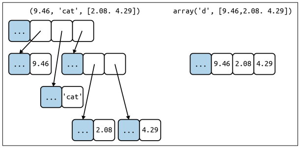
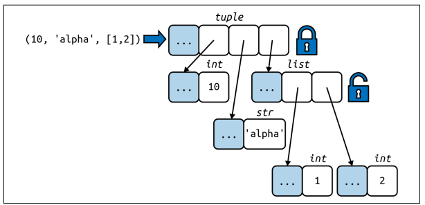

### Overview of Built-In Sequences
根据Sequences中存储的元素类型，可分为Container sequences和Flat sequences。
<ul>
    <li>Container sequences: 可存储不同类型的元素(下左图)</li>
    <li>Flat sequences: 只能存储一种类型的元素(下右图)</li>
</ul>
<div style='text-align:center'></div>
<div style='text-align:center'>Container sequences v.s. Flat sequences</div>

根据Sequences中存储的元素是否可变，可分为Mutable sequences和Immutable sequences。
<ul>
    <li>Mutable sequences: 其中的元素可变</li>
    <li>Immutable sequences: 其中的元素不可变</li>
</ul>

### List Comprehensions and Generator Expressions
若需要快速生成序列类型，可使用列表推导式(list comprehensions)(生成的对象为`list`)或生成器表达式(generator expressions)(生成对象为其他序列类型)。

* 列表推导式
``` py title="列表推导式1" linenums="1" 
>>> x = 'ABC'
>>> codes = [ord(x) for x in x]
>>> x 
'ABC'
>>> codes
[65, 66, 67]
```
``` py title="列表推导式2" linenums="1" 
>>> colors = ['blank', 'white']
>>> sizes = ['S', 'M']
>>> tshirts = [(color, size) for color in colors for size in sizes]
>>> tshirts
[('blank', 'S'), ('blank', 'M'), ('white', 'S'), ('white', 'M')]
```

* 生成器表达式
``` py title="生成器表达式1" linenums="1" 
>>> x = 'ABC'
>>> codes = (ord(x) for x in x)
>>> x 
'ABC'
>>> list(codes)
[65, 66, 67]
```
``` py title="生成器表达式2" linenums="1" 
>>> colors = ['blank', 'white']
>>> sizes = ['S', 'M']
>>> for tshirt in (f'{color} {size}' for color in colors for size in sizes)
...     print(tshirts)
blank S
blank M
white S
white M
```
<strong>生成器表达式用更少的存储空间，因为其中的元素是按需逐个生成的。而列表推导式是一下子将所有元素生成列表。</strong>

### Tuples Are Not Just Immutable List 
tuple既可以作为不可变列表，也可以用作没有字段名称的记录。

* tuple作为没有字段名称的记录
```py title="tuple作为没有字段名称的记录" linenums="1"
>>> traveler_ids = [('USA', '31195855'), ('BRA', 'CE342567'), ('ESP', 'XDA205856')]
>>> for passport in sorted(traveler_ids):
...     print('%s/%s' % passport)
...
BRA/CE342567
ESP/XDA205856
USA/31195855
```
* tuple作为不可变的list<br/>
  这样可以带来两个好处：1.<strong>简洁</strong>：当使用tuple时，你应该知道它的长度不可变。2.<strong>效率更高</strong>：对于同等长度的list与tuple，tuple所需的存储空间更小。但是，应该注意的是虽然tuple中元素值不可改变，但是元素值所指对象是可以改变的，如下图所示。
  <div style='text-align:center'></div>
  <div style='text-align:center'>The content of the tuple itself is immutable, but referenced objects is mutable.</div>
  如果需要判断tuple是否有固定的值，可使用`hash`函数，如下所示。
  ```py title="判断tuple是否有固定的值的fixed函数" linenums="1"
  >>> def fixed(o):
  ...     try:
  ...         hash(o)    # 获取o的哈希值
  ...     except TypeError:
  ...         return False
  ...     return True
  ```
### Unpacking Sequences and Iterables
* unpacking的第一种方式：parallel assignment
  ```py title="最常见的unpacking形式:parallel assignment" linenums="1" 
  >>> lax_coordinates = (33, 118)
  >>> lat, lon = lax_coordinates    # unpacking
  >>> lat
  33
  >>> lon
  118
  ```
* unpacking的第二种方式：prefixing an argument with *
  ```py title="unpacking的另一种方式:prefixing an argument with *" linenums="1" 
  >>> divmod(20, 8)
  (2, 4)
  >>> t = (20, 8)
  >>> divmod(*t)
  (2, 4)
  ```
除了上面所示，*还有以下的一些作用：
* 使用*去除多余的元素
  ```py title="使用*去除多余的元素" linenums="1" 
  >>> a, b, *rest = range(5)
  >>> a, b, rest
  (0, 1, [2, 3, 4])
  >>> a, b, *rest = range(3)
  >>> a, b, rest
  (0, 1, [2])
  >>> a, b, *rest = range(2)
  >>> a, b, rest
  (0, 1, [])
  >>> a, *body, c, d = range(5)
  >>> a, body, c, d
  (0, [1, 2], 3, 4)
  >>> *head, b, c, d = range(5)
  >>> head, b, c, d
  ([0, 1], 2, 3, 4)
  ```
### Pattern Matching with Sequences
对于python 3.10，其引入了`match/case`语句，使用方法如下：
```py title="match/case的使用方法" linenums="1"
def handle_command(self, message):
    match message:                    # 需要进行匹配的为message变量的值
        case ['BEEPER', frequency, times]:   # message变量的值由三部分构成，第一个部分一定是BEEPER，将第二/三部分的值分别赋值给frequency和times变量
            self.beep(times, frequency)
        case ['NECK', angle]:          # message变量的值由两部分构成，第一个部分一定是NECK，将第二个部分的值赋值给angle变量
            self.rotate_neck(angle)
        case _:                    # 上述两种情况都不满足
            raise InvalidCommand(message)
```
此外，在`match\case`语句中能够加入对变量类型信息的判断，如下所示：
```py title="在match\case语句中加入对变量类型信息的判断" linenums="1"
case [str(name), _, _, (float(lat), float(lon))]
# name必须为str类型，lat和lon都必须为float类型
```
此外，在`match\case`语句中能够加入`if`语句，如下所示：
```py title="在match\case语句中加入if语句" linenums="1"
match record:
    case [name, _, _, (lat, lon)] if lon <= 0:
        ...
```
### Slicing
对于下述的代码
```py linenums="1" title="slice对象"
>>> s = 'bicycle'
>>> s[0:2]
'bi'
```
实际上，在`[]`中的部分产生了一个slice对象。`s[0:2]`等价于`s[slice(0, 2)]`

### Using + and * with Sequences
`+=`实际上是`__iadd__`方法在起作用。如果`__iadd__`方法不起作用，将调用`__add__`方法，即`a += b`将转换为`a = a + b`。`a + b`首先被计算，然后将该计算的结果捆绑到变量`a`上。对于mutable sequences，a+b将被捆绑到a上，`id(a)`不发生变化，而对于immutable sequences，a+b不能被捆绑到a上，因此`id(a)`发生变化。`*=`的操作与`+=`类似。

### When a List Is Not the Answer
* Arrays
  
  如果list中只有数字，那么`array.array`是一个更有效率的选择。
  ```py title="array.array用法示例" linenums="1"
  >>> from array import array
  >>> from random import random
  >>> floats = array('d', (random() for i in range(10**7)))  # 从生成器表达式构造一个双精度浮点数的array
  >>> floats[-1]
  0.07802343889111107
  ```
  
* Memory Views
  
* Numpy
```py title="numpy.ndarry用法示例" linenums="1"
>>> import numpy as np
>>> a = np.array(12)
>>> type(a)
<class 'numpy.ndarry'>
```
* Deques and Other Queues
  
  `collections.deque`为双端队列，即在队列的两端都可以增删元素。
  