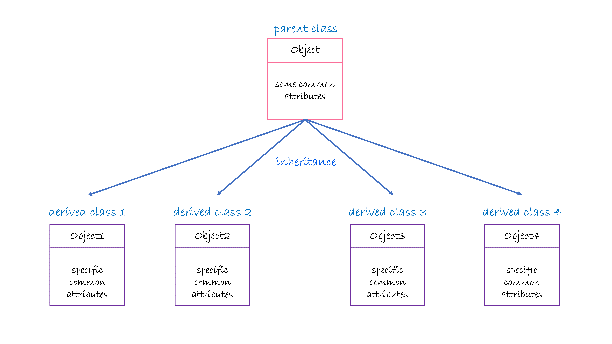
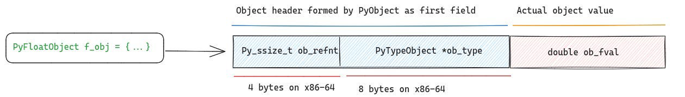

`Python`实际上底层是通过`CPython`实现的。下面是`CPython`中对`Python`中`list`对象的定义(<a href="https://github.com/python/cpython/blob/main/Include/cpython/listobject.h#L5" target="_blank">Include/cpython/listobject.h</a>)：
``` C
typedef struct {
    PyObject_VAR_HEAD   /* #define PyObject_VAR_HEAD   PyVarObject ob_base;*/
    /* Vector of pointers to list elements.  list[0] is ob_item[0], etc. */
    PyObject **ob_item;
    Py_ssize_t allocated;
} PyListObject;
```
上面的代码定义一个结构体并将其的数据类型定义为`PyListObject`。结构体中第一行本质上为`PyVarObject ob_base;`。为了解`PyVarObject`，首先需要了解`PyObject`。首先，我们需要考虑一个问题——`Python`如何实现众多的数据类型？

### `Python`如何实现众多的数据类型

若从面相对象的角度来考虑这个问题，我们只需定义一个父类，在该父类中定义这些不同数据类型共有的一些属性，然后通过类的继承定义每一种数据类型，在每一种数据类型所对应的类中实现该种数据类型特有的属性。如下图所示。
<div style='text-align:center'></div>

`PyObject`就实现了上述类似的功能，虽然`C`语言并不是一门面相对象的语言。任何在`Python`中所能接触到的对象，在`C`语言中都为`PyObject`。`PyObject`的定义如下(<a href="https://github.com/python/cpython/blob/main/Include/object.h#L110" target="_blank">Include/object.h</a>)：
``` C
struct _object {
    Py_ssize_t ob_refcnt;    /* ob_refcnt reflects the number of references to this object. */
    PyTypeObject *ob_type;   /* ob_type is a pointer to an object which contains type related information about the object.Additionally, it also maintains a table of function pointers, called the method table which includes implementation for type specific behaviors */
};
```
虽然上述定义的是`_object`，但是在<a href="https://github.com/python/cpython/blob/main/Include/pytypedefs.h#L18" target="_blank">Includes/pytypedefs.h</a>中有下列的代码：
``` C
typedef struct _object PyObject;
typedef struct _longobject PyLongObject;
typedef struct _typeobject PyTypeObject;
typedef struct PyCodeObject PyCodeObject;
typedef struct _frame PyFrameObject;
```
因此`_object`就等价于`PyObject`。

### `PyObject`实现的相关细节

`PyObject`的定义如下：
``` C
struct _object {
    Py_ssize_t ob_refcnt;    
    PyTypeObject *ob_type; 
};
```
在`PyObject`中有两个属性`ob_refcnt`与`ob_type`。其中`ob_refcnt`用于记录该变量的引用计数(reference count)，而`ob_type`是一个指针，指向`PyTypeObject`对象。`PyTypeObject`对象中含有对象的相关信息以及一些关于此对象的函数的指针等。首先，我们来考虑`ob_refcnt`。这里涉及到`Python`中的`Garbage Collection`原理(详见Fluent Python (2nd Edition) 219页)：当一个对象的`ob_refcnt`变为0时，该变量被释放。我们可以采用下列的`Python`代码来获得变量`a`的引用计数：
``` python
import sys
a = 1
# sys.getrefcount(a): get the reference count of variable a
print(sys.getrefcount(a))   
```
由于调用`sys.getrefcount()`函数时传入`a`，这会让`a`的引用计数比实际情况大1。<br />
在`CPython`中使用`Py_INCREF`与`Py_DECREF`来分别使引用计数增加1和减少1。下面是`CPython`中对于`Py_INCREF`的定义(<a href="https://github.com/python/cpython/blob/3.12/Include/object.h#L625" target="_blank">Include\object.h</a>)：
``` C
static inline Py_ALWAYS_INLINE void Py_INCREF(PyObject *op)
{
    if (_Py_IsImmortal(op)) {
        return;
    }
    op->ob_refcnt++;
}
```
`_Py_IsImmortal(op)`用于检测`op`是否为`immortal object`。若为`immortal object`，则其的引用计数不会发生变化。否则其的`ob_refcnt`值增加1。而对于`Py_DECREF`，其的定义如下(<a href="https://github.com/python/cpython/blob/3.12/Include/object.h#L696">Include\object.h</a>)：
``` C
static inline Py_ALWAYS_INLINE void Py_DECREF(PyObject *op)
{
    if (_Py_IsImmortal(op)) {
        return;
    }
    if (--op->ob_refcnt == 0) {
        _Py_Dealloc(op);
    }
}
```
与`Py_INCREF`一样，在`Py_DECREF`中首先判断`op`是否为`immortal object`。若为`immortal object`，则其的引用计数不会发生变化。否则其的`ob_refcnt`值减少1。若减1后`ob_refcnt`为0， 则调用`_Py_Dealloc`释放内存。
由于`C`语言不像面向对象语言那样有继承的相关语法，因此采用下面的方式在`PyObject`的基础上获得`PyFloatObject`：
``` C
typedef struct {
    PyObject ob_base   /* ob_base is an instance of PyObject */
    double ob_fval;    /* the value of the object itself  */
} PyFloatObject;
```
实际上，上述的结构体在内存中是按照如下的顺序进行排列的：
<div style='text-align:center'></div>

即该结构在内存中总是以`PyObject`的相关信息开头。<br />
对于`Python`中的`int`类型，在`CPython`中实际上是`long`。下面是对`long`的相关定义(`Include/cpython/longintrepr.h`)：
``` C
typedef struct _PyLongValue {
    uintptr_t lv_tag; /* Number of digits, sign and flags */
    digit ob_digit[1];
} _PyLongValue;

struct _longobject {
    PyObject_HEAD
    _PyLongValue long_value;
};
```
与`PyFloatObject`一样，`_longobject`也是以`PyObject`的相关信息开头。`long_value`才存储了对象的值。对象具体的值存储在`ob_digit`这个数组中。待存储的数值的低位信息放在低位下标中，而高位信息放在高位下标中。需要注意的是，实际存储时，是以二进制的形式存储的。

### `Python`中`list`的实施细节

对于`PyVarObject`，其在`PyObject`的基础上，增加了一个`ob_size`属性。该属性用于说明对象的长度。`PyListObject`定义中的第二行定义了一个复合指针`ob_item`，该指针是一个指向PyObject变量指针的指针。本质上，`ob_item[0]`为列表中`0`号元素的地址，而`ob_item[1]`为列表中`1`号元素的地址，以此类推。`allocated`为内存分配的插槽数。需要注意的是内存分配的插槽数与列表的大小是有区别的。列表的大小为`ob_size`，而一般内存分配的插槽数大于列表的大小。这样做是为了避免每插入一个元素到列表中就要改变分配给列表的内存大小。实际上`Python`的列表实际是一种动态数组，当创建一个列表并添加元素时，`Python`会动态调整列表的大小以适应新增的元素。当列表的长度超过当前分配的内存空间时，`Python`会分配更大的内存块，并将元素从旧内存块复制到新的内存块中。对于`Python`中的列表，当元素出现容器或者相对于前一个元素类型改变时，内存空间就不再连续。

------

### 参考材料

[1] <a href='https://blog.codingconfessions.com/p/cpython-object-system-internals-understanding' target='_blank'>CPython Object System Internals: Understanding the Role of PyObject</a><br />
[2] <a href='https://stackoverflow.com/questions/27683764/what-is-a-pyobject-in-python' target='_blank'>What is a PyObject in Python?</a><br />
[3] <a href='https://docs.python.org/3/c-api/structures.html#c.PyObject' target='_blank'>Common Object Structures</a><br />
[4] <a href='https://stackoverflow.com/questions/3917574/how-is-pythons-list-implemented' target='_blank'>How is Python's List Implemented?</a><br />
[5] <a href='https://www.cnblogs.com/hellcat/p/8795841.html' target='_blank'>Python内存分析list与array</a><br />
[6] <a href='https://blog.codingconfessions.com/p/cpython-reference-counting-internals' target='_blank'>How CPython Implements Reference Counting: Dissecting CPython Internals</a><br />
[7] <a href='https://www.cnblogs.com/ChangAn223/p/11495690.html' target='_blank'>Python 3 的 int 类型详解（为什么 int 不存在溢出问题？）</a>