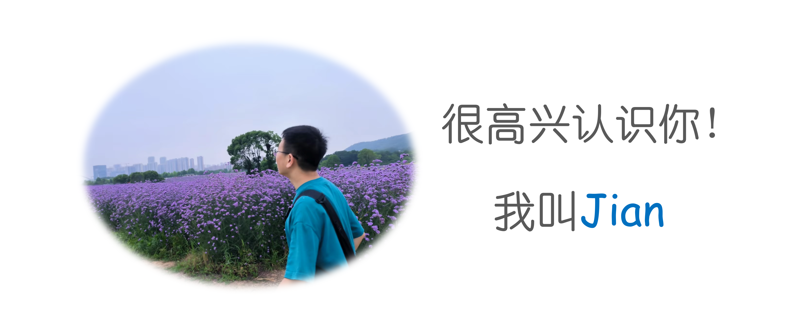
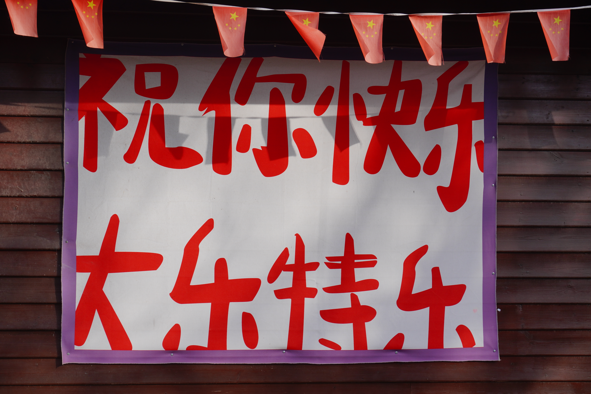

# 我是谁

    

!!! note "About me"
    - 一名在武汉的搬砖人
    - 一名不务正业的化学人，讨厌过柱子，讨厌洗烧杯，讨厌做化学实验
    - 喜欢研究编程语言(主要是C++和Python，热爱OOP，热爱开源)，空闲时喜欢做些小玩意(做的一部分小玩意详见[这里:smile:](https://github.com/luck19990920))
    - 喜欢研究计算机组成原理(主要对ARM与RISC-V架构感兴趣)(在这里感谢Sarah L.Harris与David Harris编著的[Digital Design and Computer Architecture(RISC-V Edition)](https://pages.hmc.edu/harris/ddca/ddcarv.html)一书，这本书是我学习计算机组成原理的入门书，强烈推荐！)
    - 偶尔会玩玩单片机(主要是STM32)，研究一下硬件与软件之间关联
    - 偶尔会夜跑和骑行
    - 一名摄影爱好者和旅行爱好者(拒绝特种兵式旅行，热爱探索文化)
    - 热爱阅读(主要是非虚构书籍)
    - 热爱自由，讨厌教条主义，形式主义

# 人生态度

&emsp;&emsp;行刑日那天把最好的衣服穿上；挺直腰杆站直，显现一股傲气，好在行刑队心里留下美好的印象。诊断出罹患癌症时，不要哭天喊地，做出一副无辜受害的样子。只和医生讨论病情，切莫让别人知道，如此就可避免听到老掉牙的安慰话，也没人会视你为值得同情的受害者。此外，那种有尊严的态度，可以让挫败和胜利一样，叫人觉得具有英雄气概。赔钱的时候，务必对你的助理更加客气，不要对他发怒。不要将你的命运怪罪于任何人，即使他们确实是祸首。别怨东怨西。如果你的生意变少，不要马上哈腰屈膝，可以像我儿时的好友艾波史雷曼那样，发出一份充满英雄气概的电子邮件给同行，告诉他们：“生意虽少，态度不变。”命运女神唯一不能控制的东西，是你的行为。 &emsp;&emsp;祝你好运！

——纳西姆·尼古拉斯·塔勒布《随机漫步的傻瓜》

# 致每一位陌生人

    

(拍摄于烟台市烟台山)

# 我的履历

  

    

      <h3>2015</h3>
      
高中入学(理科)

    

    

      <h3>2018</h3>
      
本科入学(应用化学)

    

    

      <h3>2022</h3>
      
研究生入学(计算化学)

    

    

      <h3>2025</h3>
      
探索新可能

    

  

# 我的联系方式

* 邮箱：jianzhang1920@gmail.com
* 微信号：a15107223626
* 博客评论区留言