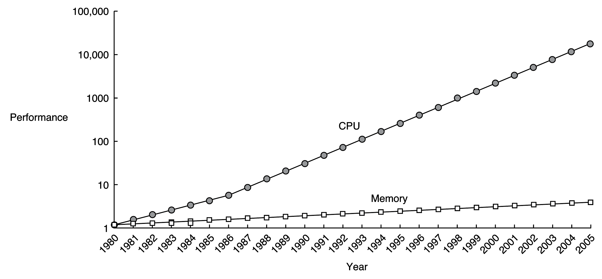
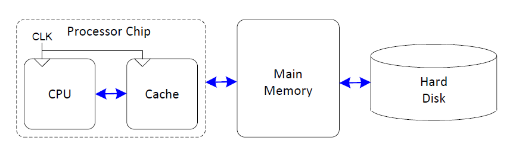
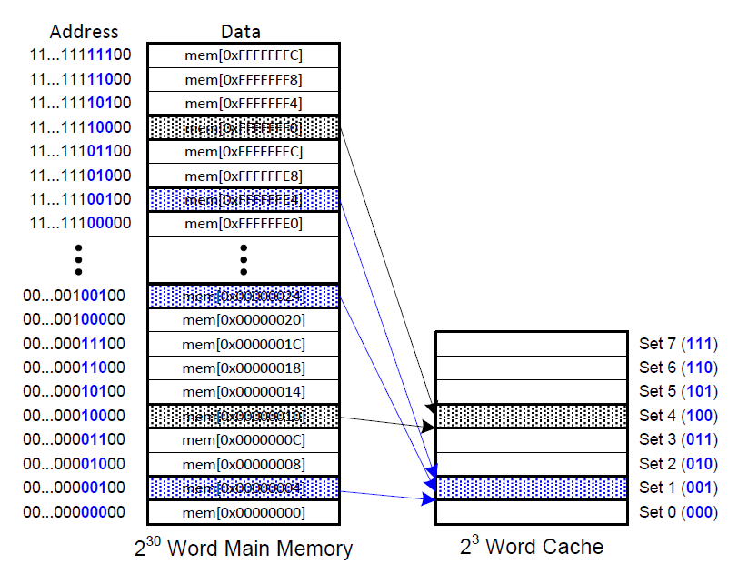
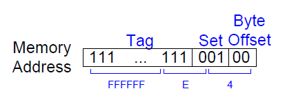
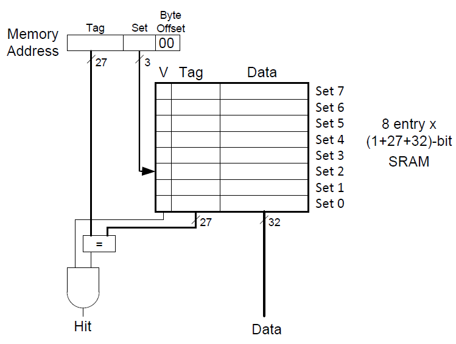
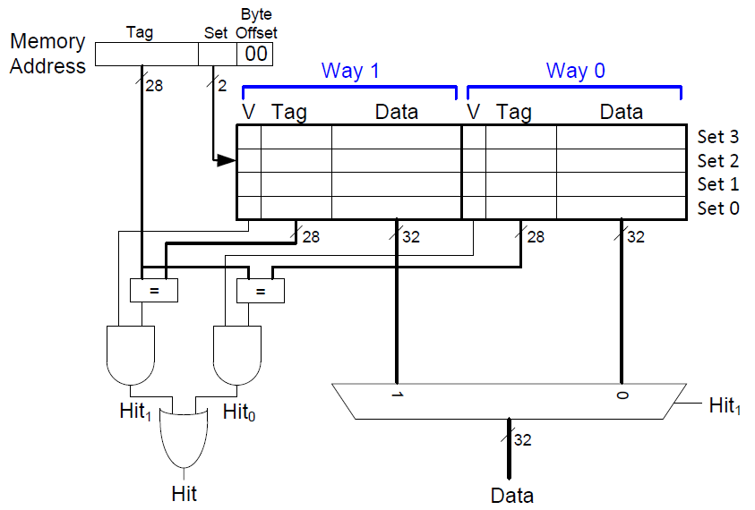
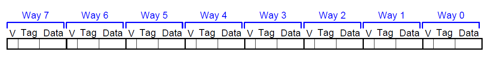
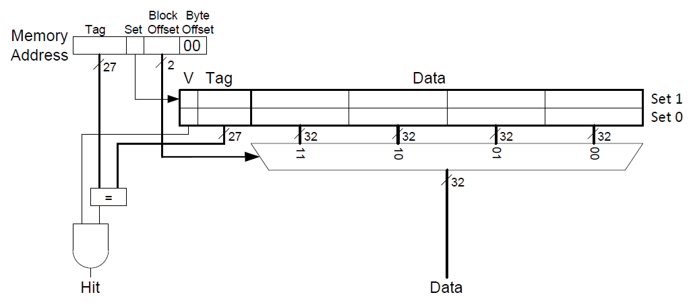
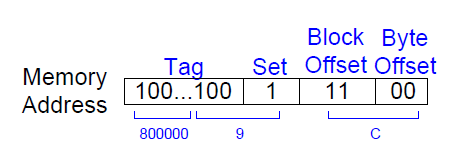
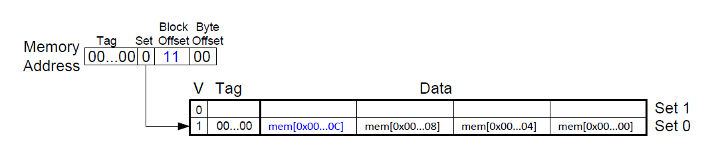

---
categories:
    - Computer Science
date: 2025-05-24
comments: true
slug: cache/
authors: [zhangjian]
---

# 缓存的相关理解

本篇文章主要结合Computer Systems: A Programmer's Perspective与Digital Design and Computer Architecture(RISC-V Edition)这两本书记录对缓存的相关理解。

<!-- more -->

### 为什么要缓存
计算机的性能取决于处理器的性能与存储系统的性能。处理器的运算速度和在存储系统寻找相关数据的速度要足够快才能保证计算机的性能足够好。一个理想的存储系统应该足够快、便宜并且存储容量大。但是，实际上这三者无法同时满足。处理器与主存(DRAM)的效率比较如下图所示。
<figure markdown="span">
  { width="500" }
</figure>
由上图可知，1980年后，处理器与主存(即DRAM)性能的差异越来越大。该性能的差异会拖慢计算机处理数据的速度。为了解决这个问题，计算机中将使用频率较高的数据保存在一块相较于DRAM速度更快的存储空间中，即缓存。缓存通常为SRAM。由于SRAM速度比DRAM更快，并且其与处理器都在一块芯片上(这减少了信号传输的延时)，因此缓存的速度与处理器的速度相差不大。最终，可得到如下的存储系统层次结构。
<figure markdown="span">
  { width="500" }
</figure>
目前，为解决CPU与主存之间巨大的性能差异，计算机中使用了三级缓存结构。

* L1高级缓存(一级缓存)：访问速度几乎与寄存器一样快，大约需要4个时钟
* L2高级缓存(二级缓存)：大约需要10个时钟周期
* L3高级缓存(三级缓存)：大约需要50个时钟周期

以下的解释假设只有一级缓存，并且使用的指令集为RISC-V中的RV32I。

### 该放什么数据在缓存中
理解缓存的第一步是理解缓存如何选择数据的。一个很自然的想法是事先在缓存中存放处理器即将使用的数据。这样会使得缓存命中率达到100%。但是这存在一个问题，即缓存如何预测处理器即将使用的是哪些数据。实际上，缓存利用**时间局部性**(temporal locality)和**空间局部性**(spatial locality)完成上述的预测。在这里，**时间局部性**也就是处理器更倾向于访问之前访问过的数据。因此，当处理器需要一个数据，而该数据不在缓存中时，该数据将被加载到缓存中。当后续需要这个数据时可直接从缓存中获取。而**空间局部性**也就是处理器更倾向于访问之间访问过的数据临近内存空间的数据。这会导致缓存从主存中复制数据时，不仅仅只是复制单个数据，也会把其临近内存空间的数据复制到缓存。

### 如何在缓存中找数据
缓存被组织成S个缓存组，每一个缓存组中包含若干个缓存块。每一个内存地址被映射到唯一的缓存组中。根据缓存组中缓存块的数量，可将缓存的方式划分为**直接映射缓存**(Direct mapped cache)、**组相联缓存**(Set associative cache)和**全相联缓存**(Fully associative cache)。

#### 直接映射缓存
该种缓存方式中每一个缓存组中只有一个缓存块。若缓存的总空间为C字节，一个块占b个字节，那么缓存中有C/b=B个缓存组。在RISV-V中，假设C为8个字，b为1个字。那么缓存中有8个缓存组。由于数据对齐的需要，内存地址的最后两位始终为0，即内存地址以4字节(即一个字)递增。由于有8个缓存组，因此需要3个位来标识其的组号。因此，内存地址接下来的三位用于组索引。例如，内存地址为`0x00000004`、`0x00000024`、...、`0xFFFFFFE4`的区域对应组1。
<figure markdown="span">
  { width="500" }
</figure>
由于存在多个内存地址对应一个缓存块的情况，所以为了确定到底是哪一个内存地址在缓存块中，需要引入`Tag`标签。该标签用于说明到底是哪一个内存地址在缓存块中。对于内存地址`0xFFFFFFE4`，其对应的缓存信息如下所示。
<figure markdown="span">
  { width="300" }
</figure>
最低的2位对应字节偏移，在这里这两位始终为`0`，可以忽略。接下来的3位(因为有8个缓存组，故需要3个位标识)表明其对应着哪一个缓存组。接下来的27位充当`Tag`，用于说明到底是哪一个内存地址在缓存块中。

当计算机刚启动时，缓存中是没有数据的。缓存使用有效位(valid bit)来说明该缓存中的数据是否有意义。有效位为1说明数据有效，反之则无意义。下图为直接映射缓存硬件实现。
<figure markdown="span">
  { width="500" }
</figure>

* 通过内存地址获取`Tag`与缓存组序号(`Set`)
* 根据`Set`找到对应的缓存组，通过有效位(`V`)判断数据是否有效，通过`Tag`判断是否为对应的那个内存地址
* 符合要求则缓存命中，否则不命中

#### 组相联缓存
组相联缓存中每一个缓存组中缓存块的个数大于1。对于缓存的总空间为8个字，每一个缓存组中有2个缓存块的情况，此时缓存组的个数为4，需要2个位来标识缓存组的序号。下图为其的硬件实现。
<figure markdown="span">
  { width="500" }
</figure>

#### 全相联缓存
全相联缓存中只有一个缓存组。所有的缓存块都在这一个缓存组中。如下图所示。
<figure markdown="span">
  { width="600" }
</figure>

上述的例子中，缓存块的大小只为1个字。这只能体现出时间局部性。而当缓存块的大小大于1个字时，其临近的数据也会被复制到缓存中。这体现了空间局部性。下图为一个总空间为8个字，每个块的空间为4个字的直接映射缓存结构示意图。
<figure markdown="span">
  { width="600" }
</figure>
该缓存中，有2个缓存组，因此只需要1个位来标识缓存组的序号。每个缓存块中可以放4个字，因此需要有2个位来描述对应的是缓存块中的那一个字。下图为内存地址`0x8000009C`，其对应的缓存信息。
<figure markdown="span">
  { width="300" }
</figure>
对于下面的RISC-V汇编代码
```
        addi s0, zero, 5
        addi s1, zero, 0
LOOP:   beq s0, zero, DONE
        lw s2, 4(s1)
        lw s3, 12(s1)
        lw s4, 8(s1)
        addi s0, s0, -1
        j LOOP
DONE:
```
当执行到`lw s2, 4(s1)`时，内存中地址为`0x0`至`0xC`中的内容都将会被复制到缓存组0中，如下图所示。
<figure markdown="span">
  { width="700" }
</figure>

### 如何替换缓存中的数据
当缓存中空间已满并且需要加载新的数据到缓存中时，面临着如何替换缓存中数据的问题。最简单的替换策略是随机选择要替换的缓存块。其他更复杂的策略利用了局部性的原理。例如，**最不常使用**(Least-Frequently-Used, LFU)策略会替换在过去某个时间窗口内引用次数最少的那个块。**最近最少使用**(Least-Recently-Used, LRU)策略会替换最后一次访问时间最久的那个块。

### 如何将缓存中的数据写回
缓存中写的方式可以分为**直写**(write-through)和**写回**(write-back)两种。

* 直写：立即将缓存块写回到紧接着的低一层存储系统中。缺点就是每次写都会引起总线流量。
* 写回：尽可能地推迟更新，只有当替换算法要驱逐这个更新过的块时，才把它写到紧接着的低一层存储系统中。缺点就是增加了复杂性，必须为每一个缓存块增加一个修改位(dirty bit)。该修改位表明该缓存块是否被修改过。当为1时，表明被修改过，反之则没有被修改过。