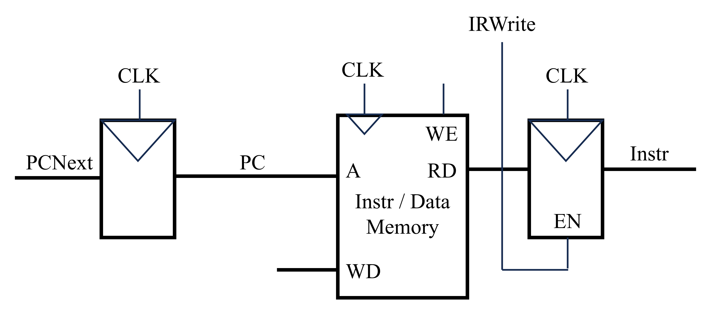
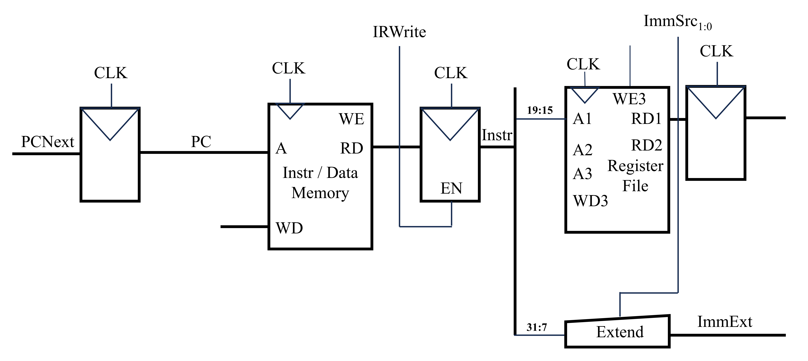
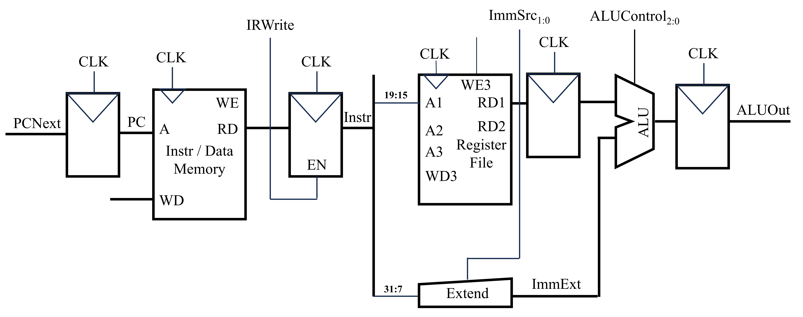
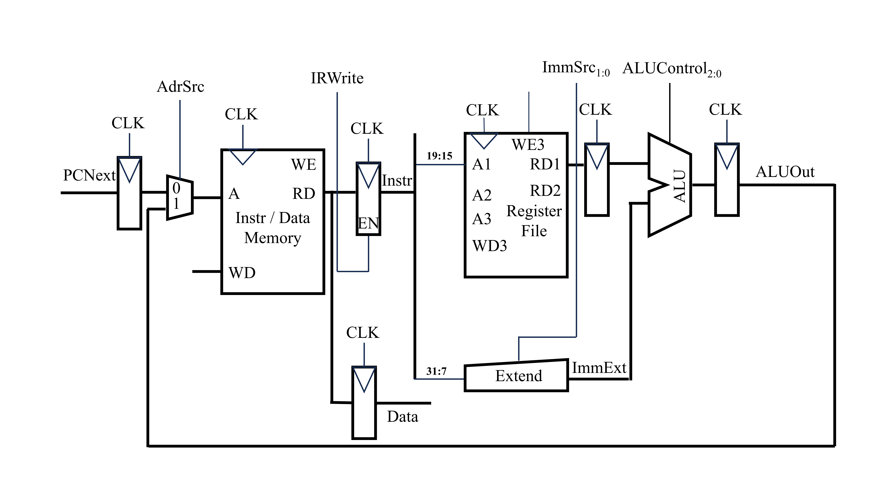
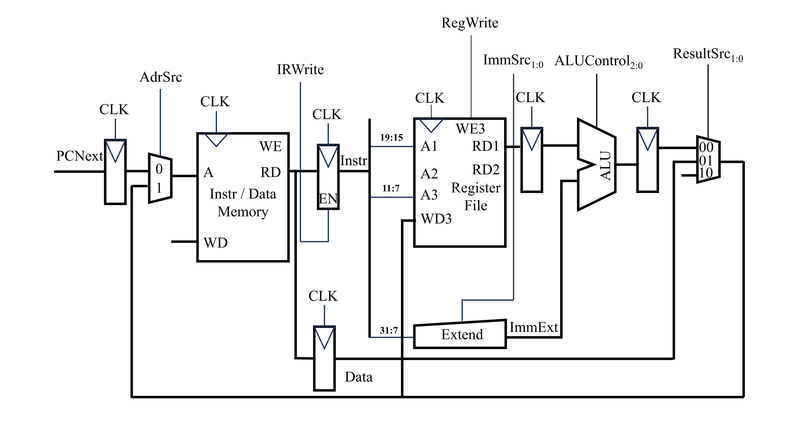
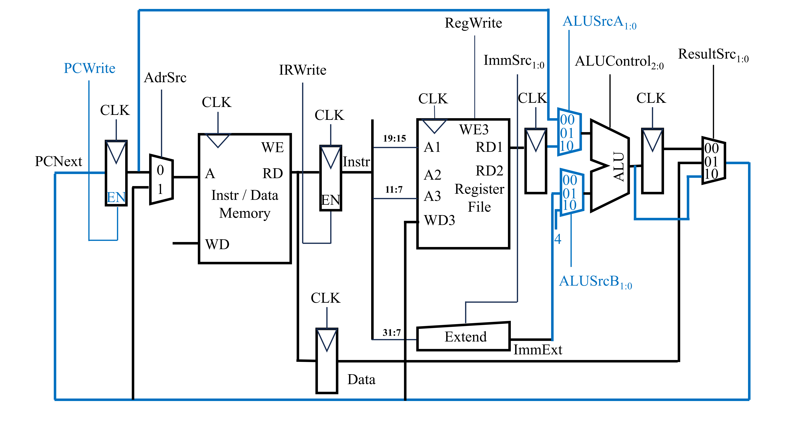
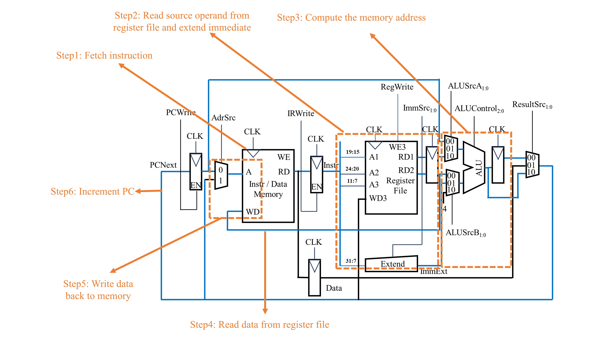

---
categories:
    - Computer Science
date: 2025-04-28
comments: true
draft: true
slug: multicycle/
authors: [zhangjian]
---

# 多周期微架构的实现(RISC-V指令集)

本篇文章主要用于记录在学习Digital Design and Computer Architecture(RISC-V Edition)一书中对多周期微架构过程的理解。

<!-- more -->

单周期微架构有如下的几个缺点：

* 需要两个存储系统分别存储指令与相关的数据
* 时钟信号周期要足够长(时钟信号周期受最慢指令的限制)
* 需要三个加法器(一个加法器在`ALU`，另外两个加法器用于计算`PCNext`)
  
相较于单周期微架构，多周期微架构将一条指令分成多个步骤。每一个时钟周期中只处理其中的一个步骤。这样可以较大限度地重复使用相关的硬件，并且加快时钟周期。下面将从`lw`指令开始，逐步构建基于RISC-V指令集的多周期微架构。

### `lw`指令
下图为在多周期微架构中从存储系统中获取指令的底层实现。相较于单周期的结构，在多周期的结构中指令与数据的存储系统合二为一并且在存储系统后增加了一个带使能端的寄存器。该寄存器的作用是将取得的指令进行保存，以便后续周期使用。当`IRWrite`为1时，该寄存器才能载入新的指令。
<figure markdown="span">
  { width="500" }
</figure>
当指令获取完成后，下一步即提取源寄存器中的值和指令中的立即数。该步的底层实现如下所示。
<figure markdown="span">
  { width="700" }
</figure>
指令(`Instr`)被分成了两个部分。第一个部分为指令的第19至15位，该部分对应着源寄存器的地址。将部分由寄存器文件的`A1`端口输出，即可在`RD1`端口输出该寄存器对应的值。并将该值利用寄存器进行保存。指令的第二个部分为指令的第31至7位。该部分经过`Extend`后获得一个通过符号拓展得到的32位立即数。不同的指令立即数的位不一样，因此使用`ImmSrc`信号来控制。

当获得了未偏移的地址和偏移量后，下一步就是将这两者相加。该步使用`ALU`实现。`ALUControl`用于控制`ALU`进行何种运算。计算的结果为`ALUResult`。同样，其也被存储在寄存器中。如下图所示。
<figure markdown="span">
  { width="800" }
</figure>
当计算的得到了偏移之后的内存地址后，下一步就是从存储系统中提取中该值。实现该功能的电路如下图所示。在前面电路的基础上，在这里在存储系统之前增加了一个复用器。该复用器决定着从存储系统中提取数据的地址来源。当`AdrSrc`为0时，地址来自于`PC`。当`AdrSrc`为1时，地址来自于`ALU`计算得到的结果。在执行`lw`指令的过程中，在最开始时，`AdrSrc`应当被置为0。而后面当需要从存储系统中读取值时，`AdrSrc`应当被置为1。另外，从内存系统中读取的值也被放置在一个寄存器中。
<figure markdown="span">
  { width="800" }
</figure>
最后一步即将相关的数据写回寄存器中。在这里`Instr`中的第11至7位为目标寄存器对应的地址。将其接入寄存器文件的`A3`端口，用于写操作。写入时，寄存器文件的`RegWrite`应被置为1。值得注意的是，需要写入的数据并不是直接连在`WD3`端口，而是采用一个复用器选择需要写入寄存器的信号来源。
<figure markdown="span">
  { width="800" }
</figure>
在上述过程进行的同时，PC应该进行更新。在单周期微架构中，PC的更新采用单独的一个的加法器实现。而在多周期微架构中，该步利用电路中已经存在的`ALU`实现。下图蓝色部分为实现PC更新而调整的电路。在该电路中，`ALU`的两个输入端口均使用复用器进行信号选择。当`ALUSrcA`为`00`时，`SrcA`来自PC。当`ALUSrcA`为`10`时，`SrcA`来自寄存器。同理，当`ALUSrcB`为`01`时，`SrcB`来自`Extend`单元，是一个立即数。当`ALUSrcB`为`10`时，`SrcB`为4，用于处理PCNext=PC+4。
<figure markdown="span">
  { width="800" }
</figure>
总的来说，`lw`指令的执行可以分为如下的几个步骤：

* Step 1: 获取指令
* Step 2: 从寄存器文件中获取源操作数并且对指令中的立即数进行符号拓展
* Step 3: 采用ALU计算内存地址
* Step 4: 从内存地址中读数据
* Step 5: 将数据写回寄存器文件中
* Step 6: 增加PC：PC=PC+4

### `sw`指令
<figure markdown="span">
  { width="1000" }
</figure>
上图为执行`sw`指令的底层电路。该指令的实现过程也是从取指开始。该指令的19至15位对应着`rs1`寄存器，31至7位对应着立即数。`rs1`寄存器与立即数之和则为最终需要写入数据的内存地址。该步可使用`ALU`实现。此外，指令的24至20位对应着`rs2`寄存器。该寄存器中的值是要写入内存中的值。因此，在这里存储系统的写入端口`WD`接入该值。最后，PC进行更新。