# 单周期微架构的实现(RISC-V指令集)

本篇文章主要用于记录在学习Digital Design and Computer Architecture(RISC-V Edition)一书中对单周期微架构过程的理解。

<!-- more -->

下面的讨论主要围绕以下的RISC-V汇编代码的实现展开。
```
0x1000  L7: lw  x6, -4(x9)
0x1004      sw  x6, 8(x9)
0x1008      or  x4, x5, x6
0x100C      beq x4, x4, L7
```
假设初始情况下`x9`寄存器中的值为`0x2004`，`x5`寄存器中的值为`6`，内存地址`0x2000`处的值为10。则，

* 汇编代码第一行：将内存地址为`0x2004-4=0x2000`处的值(即`10`)复制到寄存器`x6`中
* 汇编代码第二行：将寄存器`x6`中的值复制到内存地址`0x2004+8=0x200C`处
* 汇编代码第三行：对`x5`与`x6`寄存器中的值按位进行或操作，并将结果写入`x4`寄存器中
* 汇编代码第四行：比较`x4`寄存器中的值是否等于`x4`寄存器中的值，等于则跳转到`L7`指令地址。很明显，上述条件始终满足，因此该段程序持续运行

### 指令的底层实现

对于指令的实现过程，第一个阶段即从指令存储器(Instruction Memory)中提取出指令。该过程能使用如下的电路结构实现：
<figure markdown="span">
  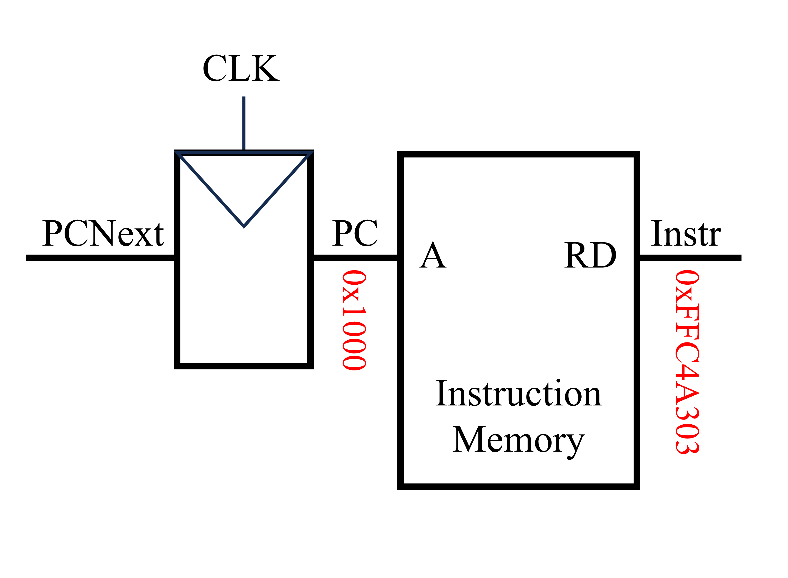{ width="300" }
</figure>
该电路左侧输入的为下一条指令的地址(`PCNext`)，当时钟上升沿时，下一条指令的地址通过触发器成为`PC`(注：`PCNext`与`PC`均为32位二进制数)。指令存储器的输入为所需执行指令的地址(在这里为`PC`)，指令存储器的输出为`PC`处的指令内容(`Instr`)。对于第一条指令`lw x6, -4(x9)`，PC为`0x1000`，`Instr`为`0xFFC4A303`。该条指令由汇编代码转换为机器代码的过程如下图所示。
<figure markdown="span">
  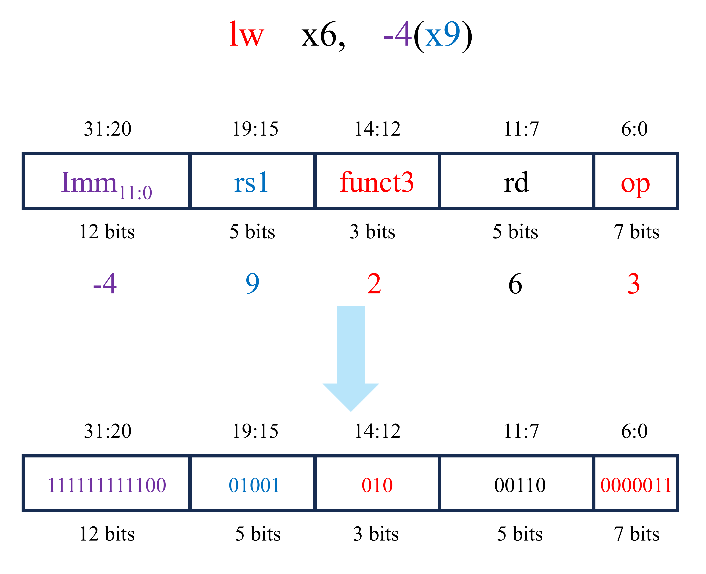{ width="400" }
</figure>
当提取完成指令后(即获得了`Instr`后)，下一步就是执行相关的指令内容。对于第一条指令(`lw x6, -4(x9)`)，下一步是读取源寄存器`x9`中的内容。由于`lw`为RISC-V中的I型指令，因此根据RISC-V指令集编码规则可知，`lw x6, -4(x9)`指令对应的机器代码的19至15位为对应源寄存器的编号。将得到的寄存器编号传入寄存器文件(Register File)，即可以获得该寄存器的内容。与上述过程同时发生的是获取地址的偏移量，由于此指令中的立即数为12位的有符号数，因此需要将其采用符号拓展的方式拓展至32位。该步骤可使用拓展单元(`Extend`)实现。符号拓展后的结果为`ImmExt`(即`0xFFFFFFFC`)。
<figure markdown="span">
  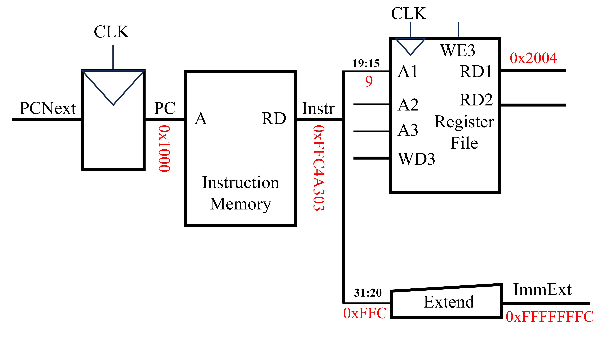{ width="500" }
</figure>
完成上述的步骤后，下一步即计算经过偏移后的内存地址。该过程可使用算术逻辑单元(`ALU`)实现，如下图所示。`ALU`的输入为两个操作数(`SrcA`与`SrcB`)，其中`SrcA`为直接从寄存器中读取的内存地址，而`SrcB`为经过符号拓展得到的地址偏移量。此外，`ALU`还需一个`ALUControl`信号输入，该信号控制`ALU`执行何种操作。在这里，`ALUControl`与`ALU`操作之间的关系如下：

* `ALUControl`=`000`, `Function`=`Add`
* `ALUControl`=`001`, `Function`=`Subtract`
* `ALUControl`=`010`, `Function`=`AND`
* `ALUControl`=`011`, `Function`=`OR`
* `ALUControl`=`101`, `Function`=`SLT`

实现上述过程的电路结构图如下所示。
<figure markdown="span">
  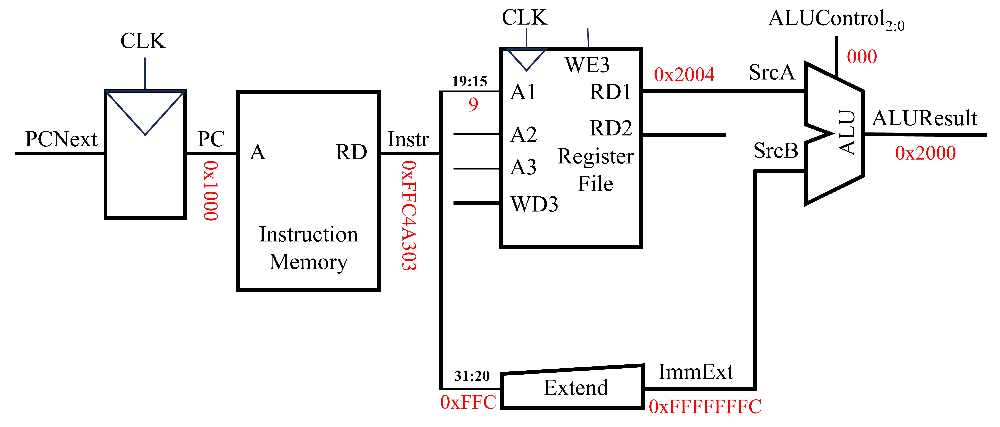{ width="600" }
</figure>
当采用`ALU`得到最终的内存地址后，下一步则是将该内存地址上的值写回至特定的寄存器中，如下图所示。
<figure markdown="span">
  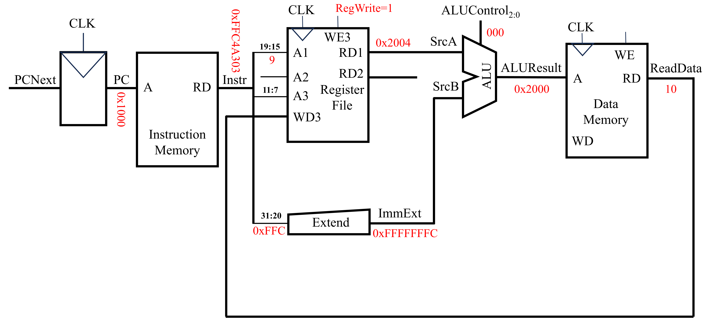{ width="600" }
</figure>
上图数据存储器(Data Memory)中，`A`端口用于地址输入，`RD`用于读输出，`WD`用于写输入。当`WE`为1时，才能够写入数据。数据存储器读出的数据为`ReadData`(即10)。该数据通过寄存器文件的`WD3`端口写入，`A3`端口为需要写入的内容对应着的寄存器序号和`WE3`控制能否写入。

当第一条指令快要完成的同时，计算机需要计算下一条指令的地址，以便执行后续的指令。由于RISC-V(准确来说是RISC-V指令集中的RV32I指令集)中一条指令占4字节，因此在顺序结构中下一条指令的地址(`PCNext`)即为当前指令地址(`PC`)加上4，即`PCNext=PC+4`。该过程可使用一个加法器来完成，如下图所示。
<figure markdown="span">
  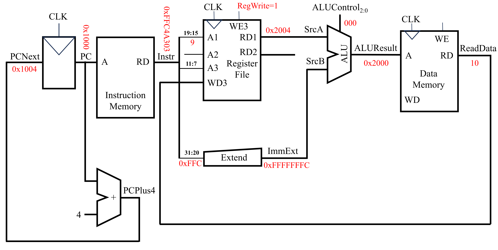{ width="600" }
</figure>
至此，上述汇编代码的第一行实现完成。下面讨论汇编代码第二行的实现。该条指令由汇编代码转换为机器代码的过程如下图所示。
<figure markdown="span">
  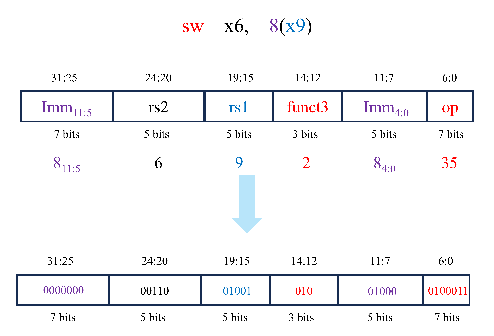{ width="500" }
</figure>
相应的电路实现如下图所示(灰线为完成本指令用不到的电路)
<figure markdown="span">
  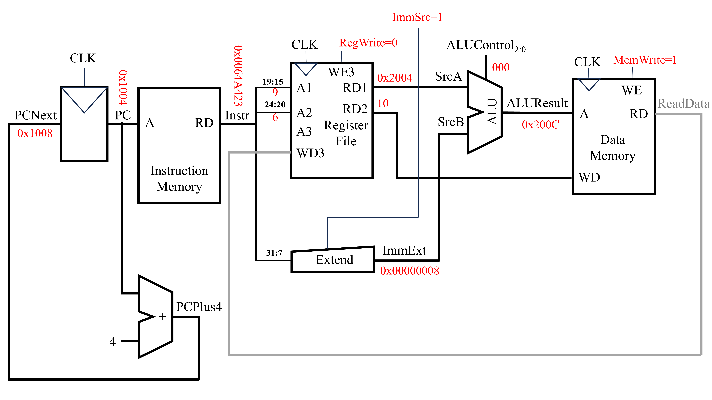{ width="600" }
</figure>
在该条指令的实现过程中，`PC`为`0x1004`，`PCNext`为`0x1008`，得到的机器语言`Instr`为`0x0064A423`。在该机器语言中，19至15位所代表的寄存器中存放着未偏移的内存地址，31至25位和11至7位为地址的偏移量。对于未偏移的内存地址，可使用寄存器文件在`A1`端读入寄存器的编号，`RD1`端输出该寄存器中的值。而对于地址的偏移量，可使用`Extend`单元对其进行提取。`Extend`上的`ImmSrc`端口控制着如何提取机器语言中的立即数部分。其中，

* `ImmSrc`=`0`，对应`lw`操作，立即数为`Instr`中的31至20位，并进行符号拓展
* `ImmSrc`=`1`，对应`sw`操作，立即数为`Instr`中的31至25位与11至7位

因此，此时`ImmSrc`=`1`。获得未偏移的地址和地址偏移量后即可以采用`ALU`计算得到最终的内存地址`ALUResult`。紧接着，将该内存地址中的值修改为`x6`寄存器中的值。`x6`寄存器中的值可在寄存器文件中提取。寄存器文件`A2`端口输入要读取的寄存器序号(即该条指令对应的机器语言的24至20位)，`RD2`端口即可输出该寄存器的值。将该值与数据存储器(Data Memory)写入端口相连，即可实现对内存地址为`ALUResult`上的值的修改。此时，数据存储器的`WE`为1。
对于第三条汇编代码(`or x4, x5, x6`)，其对应的机器代码如下图所示。
<figure markdown="span">
  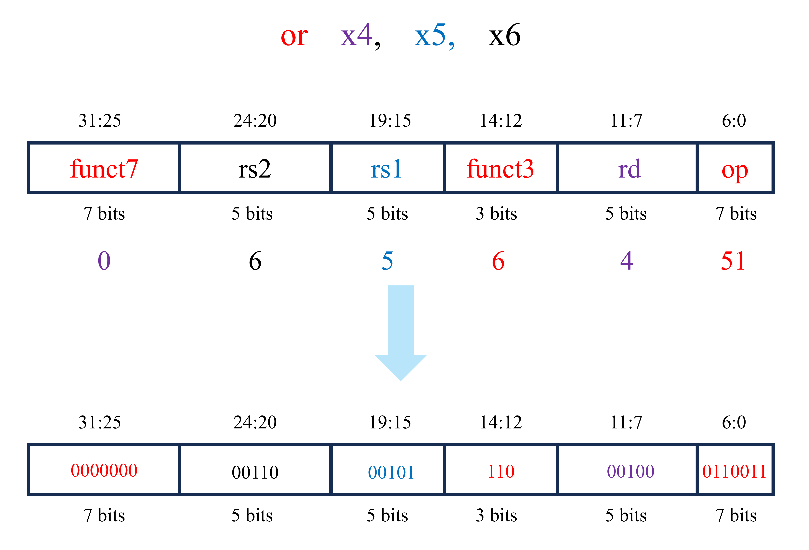{ width="500" }
</figure>
实现上述指令的电路实现如下图所示(灰线为完成本指令用不到的电路)
<figure markdown="span">
  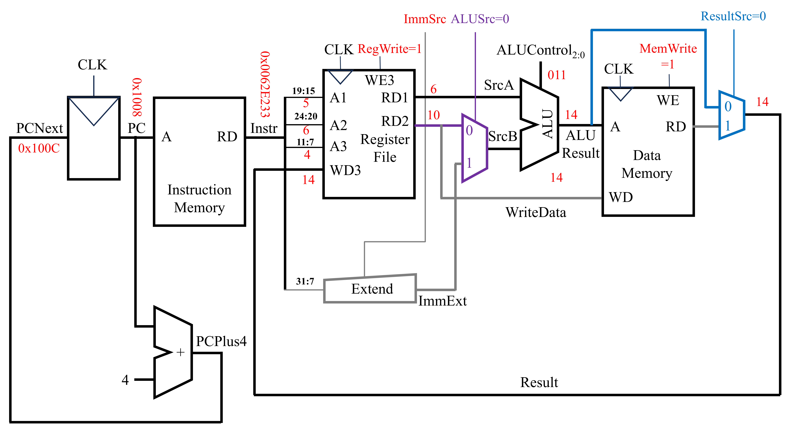{ width="600" }
</figure>
此时`PC`为`0x1008`，`PCNext`为`0x100C`，从指令存储器中获取得到的指令(即`Instr`)为`0x0062E233`。首先需要取出两个源寄存器中的值。该步可用2套寄存器文件读取端口实现。在上述电路中，端口`A1`输入第一个源寄存器(`rs1`)的序号(即`Instr`中的第19至15位)，端口`RD1`输出第一个源寄存器中的值。端口`A2`输入第二个源寄存器(`rs2`)的序号(即`Instr`中的第24至20位)，端口`RD2`输出第二个源寄存器中的值。随后将这两个寄存器中获得的值输入`ALU`中进行运算。由于`ALU`输入的两个值不一定全部都是来自寄存器，还有可能来自于指令中的立即数。因此，在寄存器文件与`ALU`之间添加一个复用器。该复用器的信号`ALUSrc`确定传入`ALU`的第二个操作数是来自寄存器还是立即数。对于`lw`/`sw`等指令，`ALUSrc`为`1`，立即数作为`SrcB`传入`ALU`。对于`R`型指令，`ALUSrc`为`0`，寄存器读出的数据作为`SrcB`传入`ALU`。在此指令下，寄存器读出的数据作为`SrcB`传入`ALU`，故`ALUSrc`为`0`。经过`ALU`计算后得到的`ALUResult`即为最终的结果。对于该条指令，还需将该结果返回至特定的寄存器中。在这之中，返回的寄存器序号为`Instr`中的11至7位。而返回寄存器的值为`ALUResult`。由于该指令与数据存储器无关，因此在前面电路的基础上，可在数据存储器后添加一个复用器，该复用器用来选择传回寄存器的值是直接来源于`ALUResult`还是从数据存储器中获得的`ReadData`。当复用器的`ResultSrc`为`0`时，返回寄存器的值直接来源于`ALUResult`。当复用器的`ResultSrc`为`1`时，返回寄存器的值来源于从数据存储器中获得的`ReadData`。

对于最后的一条指令`beq x4, x4, L7`，其的机器语言如下。
<figure markdown="span">
  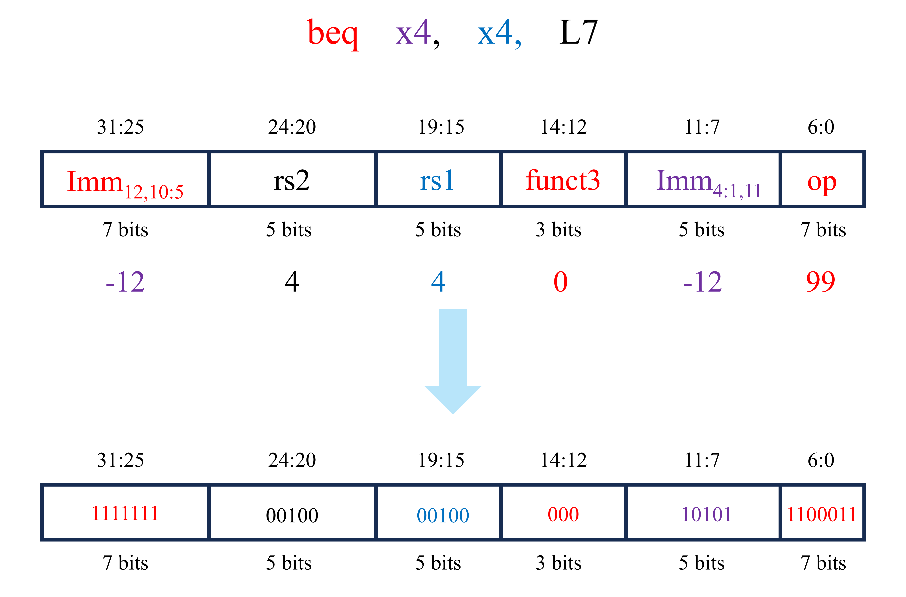{ width="500" }
</figure>
实现上述指令的电路实现如下图所示(灰线为完成本指令用不到的电路)
<figure markdown="span">
  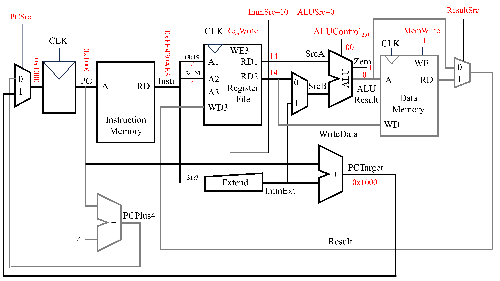{ width="600" }
</figure>
执行该指令时，`PC`为`0x100C`，从指令存储器(Instruction Memory)中获得的指令机器代码为`0xFE420AE3`。随后，从寄存器文件中获取指令中两个寄存器的值。其中，寄存器文件的`A1`端口对应着指令中`rs1`对应的寄存器的序号(即指令中的19至15位)，`RD1`端口输出`rs1`对应的寄存器中的值。而寄存器文件的`A2`端口对应着指令中`rs2`对应的寄存器的序号(即指令中的24至20位)，`RD2`端口输出`rs2`对应的寄存器中的值。`x4`寄存器中的值为`14`，因此`RD1`与`RD2`的输出值都为14。随后，将这两个值都传入`ALU`中，此时`ALUControl`为`001`(对应减法操作)。由于减法的结果为`0`，因此`ALU`中的零信号为`1`。在此基础上，上图最左侧添加了一个复用器。该复用器用来选择`PCNext`的来源。当`PCSrc`为`0`时，`PCNext`由`PCPlus4`而来。而当`PCSrc`为`1`时，`PCNext`由`PCTarget`而来。`PCTarget`是此时的`PC`值与指令中立即数的和。

以上就讨论了在本文开头展示的4条汇编语言的底层实现方式。但是上述的实现的方式还不够，因为还未直接将指令与控制信息(`PCSrc`，`RegWrite`，`ImmSrc`，`ALUSrc`，`ALUControl`，`MemWrite`和`ResultSrc`)之间联系起来。换而言之，就是只考虑了实现的功能，而未考虑控制信号。因此，下面将在上述电路的基础上增加控制单元。
<figure markdown="span">
  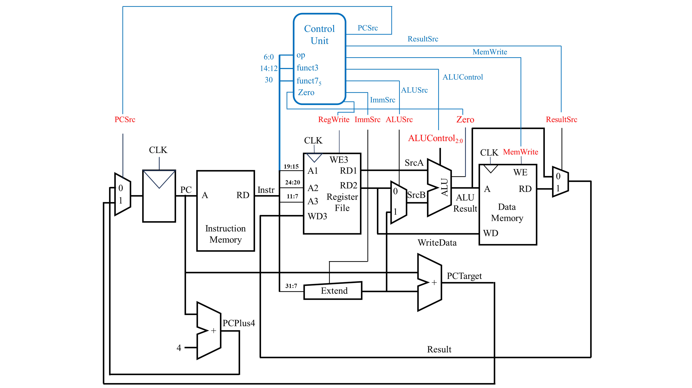{ width="800" }
</figure>

上图中蓝色部分为在原有的电路上增加的控制单元，控制单元有`4`个输入，分别为`opcode`，`funct3`，`funct7`的第5位和`ALU`计算结果中的`Zero`信号。通过指令中的`opcode`，`funct3`和`funct7`的第5位可确定是哪一个指令。而`Zero`信号则与分支语句有关。输出的有如下的`7`个信号：

* `PCSrc`：控制`PC`的下一个值。若为`0`，常规顺序结构，若为`1`，分支语句
* `ResultSrc`：控制最终结果的来源。若为`0`，结果直接来源于`ALU`，若为`1`，结果为从数据存储器中读出的值
* `MemWrite`：控制是否允许对数据存储器进行写入。若为`0`，不能写入，若为`1`，能写入
* `ALUControl`：控制`ALU`中执行的运算类型
* `ALUSrc`：控制传入`ALU`的第二个操作数的来源。若为`0`，来自寄存器文件，若为`1`，来自立即数
* `ImmSrc`：控制立即数的解码方式。若为`00`，立即数是指令`I`型指令的解码方式，若为`01`，立即数是`S`型指令的解码方式，若为`10`，立即数是`B`型指令的解码方式
* `RegWrite`：控制寄存器文件是否可以写入。若为`0`，不可以写入，若为`1`，可以写入

### 其他指令的底层实现

在上述电路的基础上，我们可以获得以下的执行`and`指令的电路实现。
<figure markdown="span">
  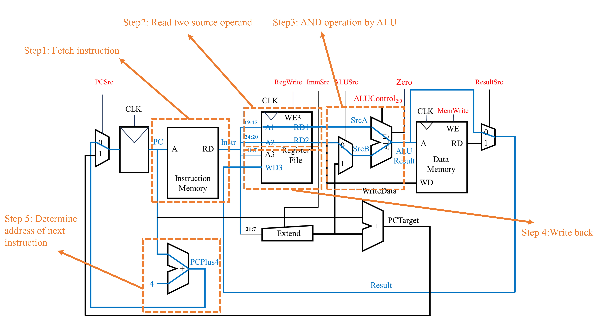{ width="800" }
</figure>

在上述电路的基础上，我们可以获得以下的执行`andi`指令的电路实现。
<figure markdown="span">
  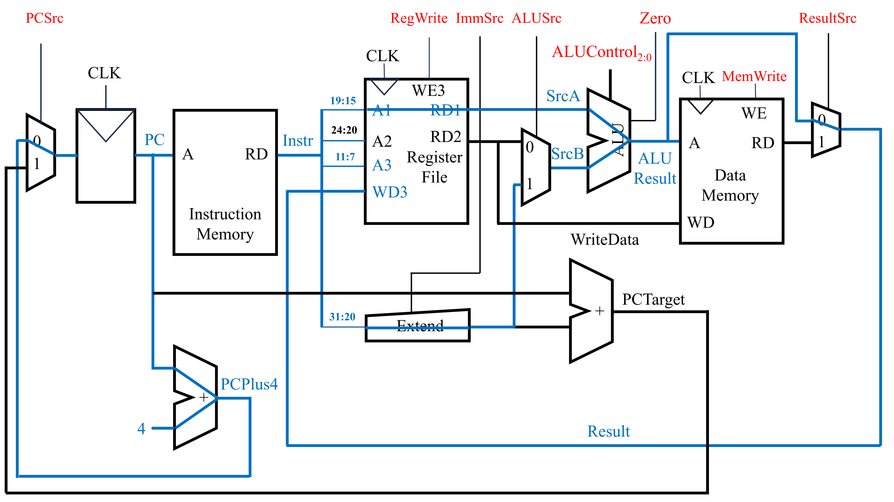{ width="500" }
</figure>

此外，我们还可以得到`jal`指令的底层电路实现。`jal rd, label`指令完成了两件事。第一件事是将`PCNext`变为`PC+imm`(`imm`通过label与目前的`PC`求差得到)。第二件事是将当前`PC`加上4的值(即后一条指令的地址)保存到寄存器`rd`中。
<figure markdown="span">
  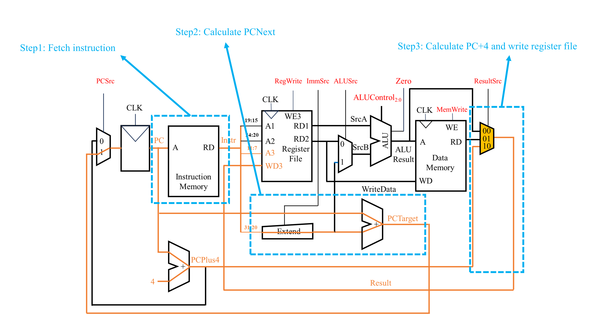{ width="800" }
</figure>
上述的`jal`指令的底层电路实现与前面讨论的其他指令的电路实现最大的区别在与最终写入寄存器文件中的结果`Result`既不来自于`ALU`直接计算的结果`ALUResult`，也不来自从数据存储器中读出的结果`ReadData`，而是来自`PCPlus4`。因此，在这里控制`Result`来源的复用器信号由之前的1位变为2位。`ResultSrc=10`对应着`Result`的结果来自`PCPlus4`。

### 底层实现效率分析

对于本篇文章设计的电路结构，`lw`是最慢的(因为相较于其他指令，`lw`指令需要读寄存器文件中的值、使用`Extend`对立即数进行符号拓展、使用`ALU`进行计算、读数据存储器的值以及写寄存器文件的值。该指令几乎把上述电路中耗时的电子元件都走了)。对于单周期处理器而言，其的时钟周期取决于最慢的那条指令。因此，下面分析`lw`指令的耗时。

<figure markdown="span">
  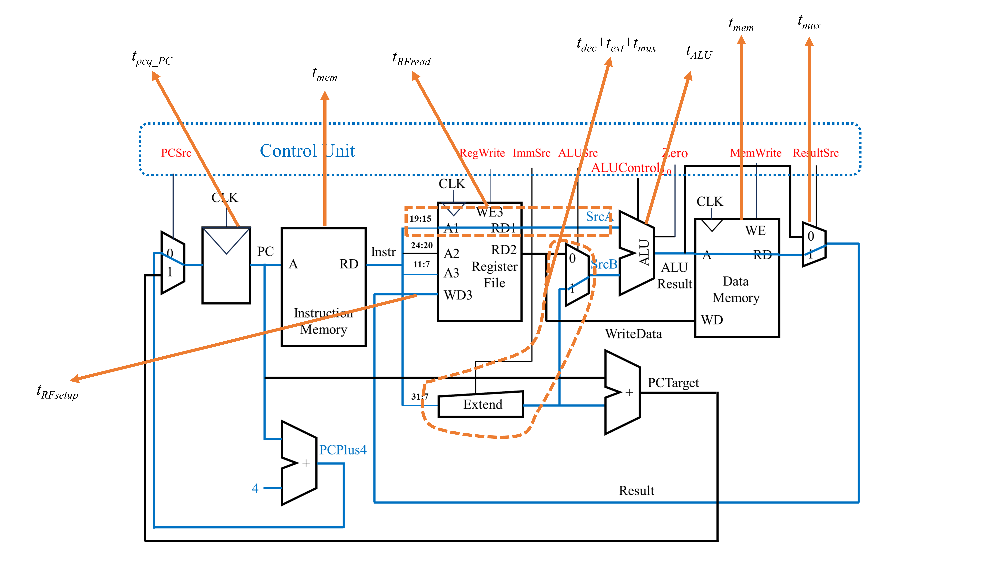{ width="1000" }
</figure>

<figure markdown="span">
  { width="700" }
</figure>
上图中，由于从寄存器中读取值与拓展立即数是同时发生的，因此需要求一个`max`函数。由于一般来说，从寄存器文件中读数据更慢。因此，上述的公式可以简化为：
<figure markdown="span">
  { width="700" }
</figure>
