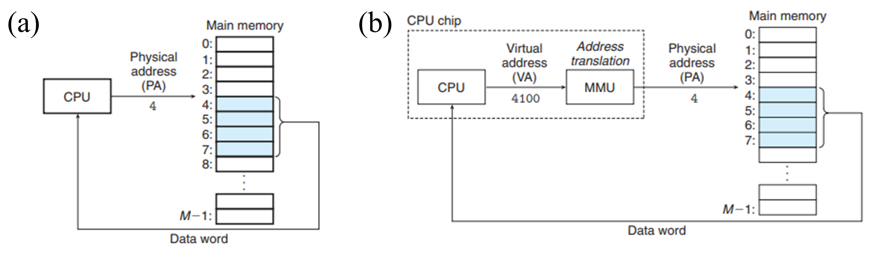

---
categories:
    - Computer Science
date: 2025-07-07
comments: true
slug: virtual_memory/
draft: true
authors: [zhangjian]
---

# 虚拟内存的相关理解

本篇文章主要结合Computer Systems: A Programmer's Perspective和Digital Design and Computer Architecture(RISC-V Edition)记录对虚拟内存的相关理解。

<!-- more -->

### 物理寻址与虚拟寻址
计算机的寻址形式有**物理寻址**与**虚拟寻址**两种。其中物理寻址(如下图所示(a))指的是将主存划分为M个连续的字节大小的数组，通过该数组的索引去访问主存。而虚拟寻址(如下图所示(b))指的是使用虚拟地址来访问主存。该虚拟地址被送到内存之前会先转换成物理地址。
<figure markdown="span">
  { width="900" }
</figure>

### 虚拟内存
物理内存即主存。而虚拟内存是计算机中用来拓展物理内存容量的一种机制。它通过将硬盘上的一部分空间当作临时内存来使用。本质上来说，物理内存是虚拟内存的缓存，即虚拟内存中的部分数据被存储在物理内存中。