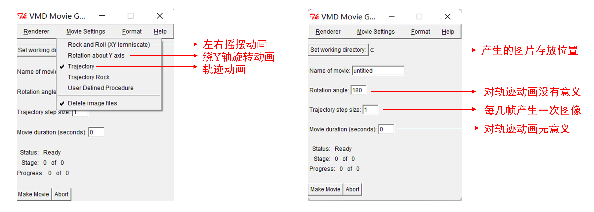

# PicToGif的使用方法

本篇文章主要用于说明PicToGif的使用方法。

<!-- more -->

### PicToGif的简要介绍

`PicToGif`是用于将多幅图片按照特定的顺序组合成GIF文件的工具。`PicToGif`采用Python进行编写，核心功能的实现用到了`imageio`库。`PicToGif`源代码以及Windows下的可执行文件可在其[主页](https://github.com/luck19990920/Scripts/tree/master/PicToGif){:target="_blank"}上进行下载。


### PicToGif的使用方法

#### Step 1:使用VMD生成多张轨迹图片

首先将轨迹文件导入VMD中，随后使用`Extensions`-`Visualization`-`Movie Maker`插件生成多张轨迹图片。该插件中相关参数的解释如下图。
<figure markdown="span">
  { width="900" }
</figure>
设置完成后，点击`Make Movie`按钮即可将生成的图片保存到指定的文件夹中(在这里，建议新建一个文件夹用于保存VMD生成的图片)。

#### Step 2:将多张轨迹图片利用PicToGif组合成GIF文件

启动`PicToGif`的方法有两种。**第一种方法**是直接将上一步获得的文件夹拉至`PicToGif.exe`上松手，随后`PicToGif`将对该文件夹进行读取。**第二种方法**是双击`PicToGif.exe`，然后输入存储图片的文件夹路径，随后`PicToGif`也会对该文件夹读取。当`PicToGif`载入文件夹完成后，窗口中将会出现以下的内容。
```
0   Extracted file type: bmp
1   Sort order: ascending
2   Frame rate: 5
3   Number of cycles: 0
4   Start to convert
q   Exit the program
```

* 选项`0`：规定需要组合成GIF文件的图片后缀名(例如png，jpg等)。**对于使用VMD生成的轨迹图片，此项不需要修改。**
* 选项`1`：规定图片排列成GIF文件的顺序(是以图片名升序排序还是降序排列)。**对于使用VMD生成的轨迹图片，此项不需要修改。**
* 选项`2`：规定GIF中每秒播放的图片数量，默认值为5。这一项需要根据实际情况进行灵活调整。
* 选项`3`：规定GIF的播放次数。若为0则为无限循环播放。这一项需要根据实际需要调整。
* 选项`4`：开始对图片进行合并，并将合并得到的GIF文件保存到与轨迹图片同级目录下。合并后得到的GIF文件文件名为`convert.gif`。
* 选项`q`：退出程序。
