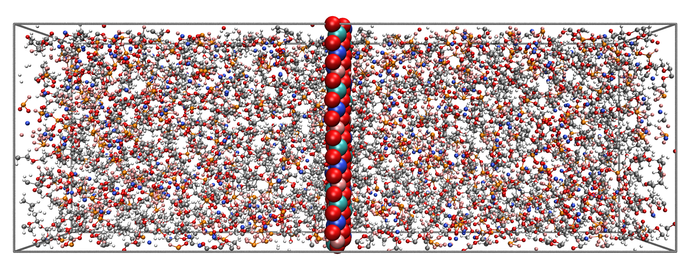
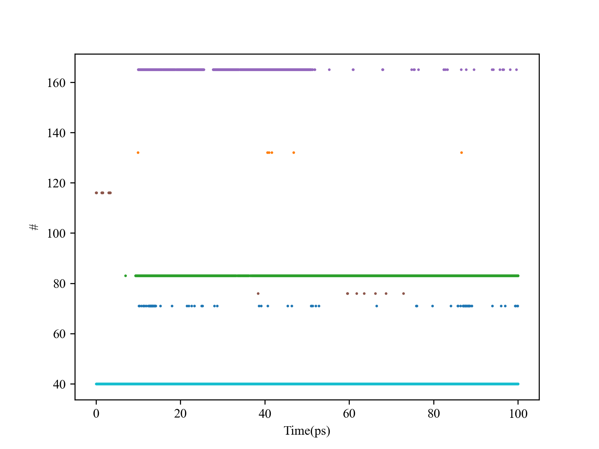

# 分子动力学模拟之自相关函数

本篇文章主要用于说明分子动力学模拟中的自相关函数。

<!-- more -->

### 问题
下图为一个中间为电极，两侧为电解质溶液的分子动力学模型。若对于该模型，我们需要统计距离电极一定范围之内A种离子溶剂化层中B种溶剂分子停留的时间，该怎么办？
<figure markdown="span">
  { width="600" }
</figure>

### 解决方法
#### 方法一
第一种方法的解决思路就是循环MD轨迹中的每一帧，然后得到每一帧中满足要求的B种溶剂分子的序号。最终将所有帧的结果放在一起对比即可获得B种溶剂分子在A种离子溶剂化层中的平均停留时间。
``` python title="方法一" hl_lines="35-38" linenums="1"
import MDAnalysis as mda
from tqdm import tqdm
import numpy as np
import matplotlib .pyplot as plt
import argparse

plt.rcParams['font.family'] = 'Times New Roman'  

parser = argparse.ArgumentParser(description="A Python script for calculating the residence time of a certain molecule in the " \
                                             "ion solvation shell within a specific distance from the electrode")

parser.add_argument("-gro", "--gro", type=str, help="gro file", default="./md.gro")
parser.add_argument("-xtc", "--xtc", type=str, help="xtc file", default="./md.xtc")
parser.add_argument("-ion", "--ion", type=str, help="string of the selection of ions")
parser.add_argument("-elec", "--elec", type=str, help="string of the selection of electrode")
parser.add_argument("-sol", "--sol", type=str, help="string of the selection of solvate")   # 必须是单个原子
parser.add_argument("-id", "--id", type=float, help="maximum distance of ions from the electrode, unit: Ångström")
parser.add_argument("-sd", "--sd", type=float, help="maximum distance of solvate from the ion, unit: Ångström")
parser.add_argument("-frame", "--frame", type=int, help="frame number")
parser.add_argument("-dt", "--dt", type=float, help="step size, unit: ps")
args = parser.parse_args()

u = mda.Universe(args.gro, args.xtc)  
sel_ion = u.select_atoms(f"({args.ion}) and (around {args.id} ({args.elec}))", updating=True)
j = 0    
sel_sol = u.select_atoms(f"{args.sol}")
result = np.zeros((int(sel_sol.n_atoms), args.frame))   
for i in tqdm(u.trajectory[:args.frame]):    
    sel_ion_index = sel_ion.indices   
    for id_ion in sel_ion_index:       
        sel_mol = u.select_atoms(f"{args.sol} and (around {args.sd} (index {id_ion}))", updating=True) 
        sel_mol_index = sel_mol.indices
        for m in sel_mol_index:           
            m += 1                        # 调整至gro中的原子序号
            if m <9095:   # 在前100中
                k = (m-3654)//5
            else:         # 在后100中
                k = 100 + (m-9095)//5
            result[k,j] = 1
    j += 1
result[result==0] = np.nan
num = result.shape[1]
for i in range(int(sel_sol.n_atoms)):
    plt.scatter(np.arange(num)*args.dt, result[i]+i, s=1)
plt.xlabel("Time(ps)")
plt.ylabel("#")
plt.savefig("./md.png", dpi=300)   
```
上面代码的第34行到第39行的作用是将获取到符合要求的原子序号进行记录。带底纹的代码需要根据传入的gro文件灵活调整。在本例中，由于我们所需要研究的溶剂分子在gro文件中不是连续出现的。因此，在这里需要对其进行处理。

运行上述的脚本，我们可以得到下面的图像。该图像的横坐标为模拟的时间，而纵坐标为溶剂分子的序号。该图的作图逻辑是若第i个溶剂分子在时刻$t$满足统计要求，那么在坐标($t$,$i$)处就打一个点。
<figure markdown="span">
  { width="600" }
</figure>
上面的脚本中，各命令行参数的意义如下：

- -gro：gro文件的路径
- -xtc：xtc文件的路径
- -ion：需要研究的离子对应的选择语句，详见[MDAnalysis中的选择语句](https://userguide.mdanalysis.org/stable/selections.html){:target="_blank"}
- -elec：电极对应的选择语句，详见[MDAnalysis中的选择语句](https://userguide.mdanalysis.org/stable/selections.html){:target="_blank"}
- -sol：需要研究的溶剂对应的选择语句，详见[MDAnalysis中的选择语句](https://userguide.mdanalysis.org/stable/selections.html){:target="_blank"}
- -id：需要研究的离子距离电极的距离阈值，单位为埃
- -sd：需要研究的溶剂距离离子的距离阈值，单位为埃
- -frame：需要统计的帧数
- -dt：步长，单位为ps

#### 方法二
第二种方法就是计算这种统计量的自相关函数。在这里，该种方法的提出受到氢键寿命计算方法的启发。对于物理量$x$从$t=t_0$到$t=t_0+\tau$的自相关函数可以通过下面的公式进行计算。
$$
C(\tau)=\left\langle \frac{x(t_0)x(t_0+\tau)}{x(t_0)x(t_0)} \right\rangle
$$

上式中的$x$就是我们所需要研究的物理量。这种物理量要能够表示为两种状态，类似于二进制中的0与1。就本文中所讨论的问题而言，B种溶剂分子是否在A种离子溶剂化层中可以用物理量$x$表示。

$$
x =
\begin{cases}
\text{1,} &\quad B种溶剂分子在A种离子溶剂化层中\\
\text{0,} &\quad B种溶剂分子不在A种离子溶剂化层中\\
\end{cases}
$$

在MDAnalysis中，可使用[autocorrelation函数](https://docs.mdanalysis.org/1.1.0/documentation_pages/lib/correlations.html){:target="_blank"}计算上述的自相关函数，下面提供一个计算的例子。
``` python title="方法二" linenums="1"
import MDAnalysis as MDA
import warnings
import numpy as np
from tqdm import tqdm
from MDAnalysis.lib.correlations import autocorrelation, correct_intermittency
import matplotlib.pyplot as plt

warnings.filterwarnings('ignore')

u = MDA.Universe("./prod.gro", "./prod.xtc")
sel_ion = u.select_atoms(f"(resname Na) and (around 5 (resname NNFM))", updating=True)
found_ls = [set() for _ in range(len(u.trajectory[:10000]))]
for i, ts in enumerate(tqdm(u.trajectory[:10000])):
    sel_ion_index = sel_ion.indices   
    for id_ion in sel_ion_index:       
        sel_mol = u.select_atoms(f"(resname POF) and (around 3 (index {id_ion}))", updating=True) 
        for m in sel_mol.indices:
            found_ls[i].add(m)

intermittent = correct_intermittency(found_ls, intermittency=0)
tau_timeseries, timeseries, timesers_data = autocorrelation(list_of_sets=intermittent, tau_max=10000, window_step=200)
np.savetxt("autocorr.txt", np.column_stack((np.array(tau_timeseries)*u.trajectory.dt, np.array(timeseries))))
```

- 第11行中采用动态选区选出我们所研究的离子
- 第12行生成一个列表，列表中的元素都是集合。该列表后续将存储每一帧中符合要求的原子序号，并作为参数传入`autocorrelation`函数中。
- 第21行用于计算自相关函数。