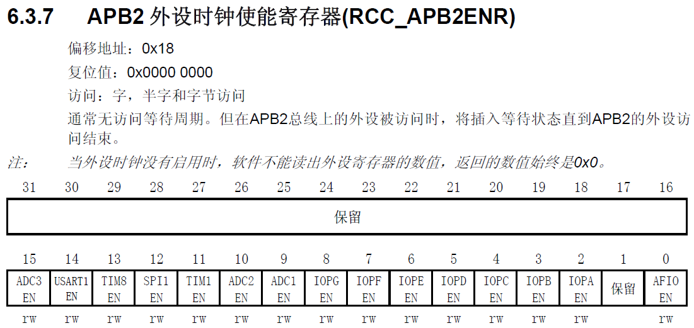
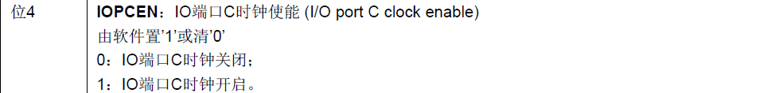
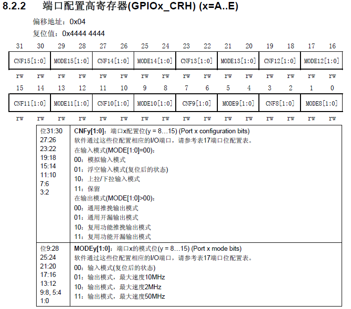
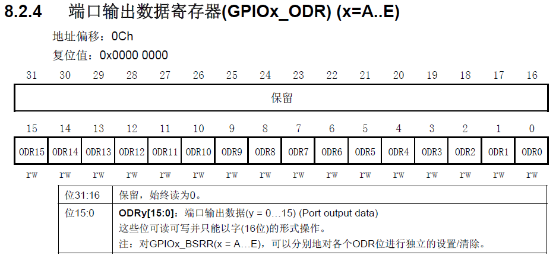
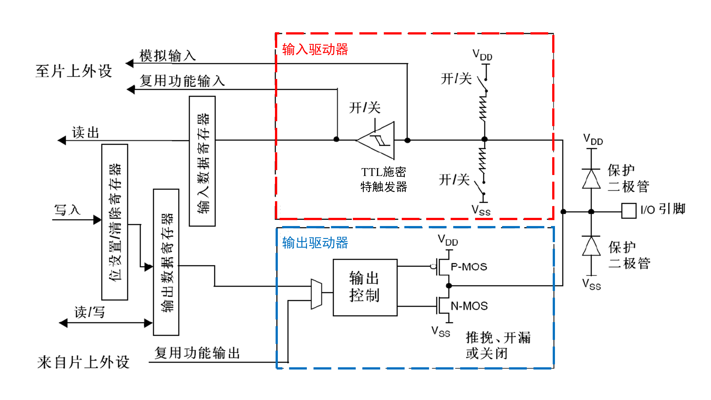

---
categories:
    - STM32
date: 2025-05-27
comments: true
slug: STM32-1/
authors: [zhangjian]
---

# STM32入门一

本篇文章主要记录在入门STM32过程中采用直接配置寄存器的方式来控制STM32以及对GPIO的相关理解。

<!-- more -->

### 采用直接配置寄存器的方式来控制STM32

<figure markdown="span">
  { width="700" }
</figure>

上图为所使用的STM32单片机。在这里，我们试图通过直接配置寄存器的方式来操纵PC13口对应的测试灯(低电平亮，高电平不亮)。由于GPIOC与APB2相连。因此，第一步就是开启其的时钟信号。查阅手册可知，`RCC_APB2ENR`为APB2外设时钟使能寄存器。并且第4位对应`IOPC EN`，如下图所示。
<figure markdown="span">
  { width="700" }
</figure>
<figure markdown="span">
  { width="700" }
</figure>
可使用如下的语句实现时钟信号的开启。
``` C
// method 1:
RCC->APB2ENR = 0x00000010;

// method 2:
RCC->APB2ENR |= 0x10;

// method 3:

// unsigned int *pRCC = (unsigned int *)0x40021000;
// unsigned int *offset = (unsigned int *)0x18;
unsigned int *add = (unsigned int *)0x40021018;

*add |= 0x10;
```
接下来配置引脚。由于所需配置的引脚为PC13，因此使用端口配置高寄存器(GPIOx_CRH)。端口配置高寄存器与端口配置低寄存器(GPIOx_CRL)的区别在于端口配置低寄存器用于配置引脚0到7的功能和参数，而端口配置高寄存器用于配置引脚8到15的功能和参数。GPIOx_CRH的用法如下图所示。
<figure markdown="span">
  { width="700" }
</figure>
由上图可知，初始情况下，该寄存器的值为`0x44444444`，即8至15号端口为输入模式，并且为浮空输入模式。在这里，我们需要改变13号端口的模式为通用推挽输出模式(最大速度50MHz)，即该寄存器对应的第23至20位为0011，即0x3。可使用如下的语句实现。
``` C
// method 1:
GPIOC->CRH |= 0x3<<20;

// method 2:

// unsigned int *pGPIOC = (unsigned int *)0x40011000;
// unsigned int *offset = (unsigned int *)0x04;

unsigned int *add_CRH = (unsigned int *)0x40011004;
*add_CRH |= 0x3<<20;
```
最后，需要设置引脚的输出信号值。完成该操作可使用端口输出数据寄存器(GPIOx_ODR)。端口输出数据寄存器的使用方法如下图所示。
<figure markdown="span">
  { width="700" }
</figure>
实现的代码如下。
``` C
// method 1:
GPIOC->ODR |= 0x2<<12;     // 灯灭
GPIOC->ODR |= 0x0;         // 灯灭

// method 2:
// unsigned int *pGPIOC = (unsigned int *)0x40011000;
// unsigned int *offset = (unsigned int *)0x0c;

unsigned int *add_ODR = (unsigned int *)0x4001100c;
*add_ODR |= 0x2<<12;       // 灯灭
*add_ODR |= 0x0;           // 灯亮
```

### GPIO

GPIO是General Purpose Input Output的缩写，即通用输入输出口。在输出模式下，其可控制端口输出高低电平。在输入模式下，其可读取端口的高低电平或电压。GPIO位结构如下图所示。
<figure markdown="span">
  { width="700" }
</figure>

* **I/O引脚附近的保护二极管**：当I/O引脚的电压大于3.3V时，上方保护二极管导通。当I/O引脚的电压小于0V时，下方保护二极管导通。当I/O引脚的电压在0V至3.3V之间，上方和下方的两个保护二极管均不会导通。此时，保护二极管对电路没有影响。
* **上拉电阻与下拉电阻**：上拉电阻与下拉电阻的开关可以通过程序配置。若上面导通，下面断开，则为**上拉输入模式**。若下面导通，上面断开，则为**下拉输入模式**。若两个都断开，则为**浮空输入模式**。这样的设置是为了给输入提供一个默认的输入电平。
* **施密特触发器**：对输入电压进行整形。如果输入电压大于某一阈值，则输出瞬间升为高电平。当输入电压小于某一阈值，则瞬间降为低电平。
* **P-MOS与N-MOS**：电子开关，需要注意的是在输出控制中存在一个反相器。在**推挽输出模式**下，P-MOS与N-MOS均有效。当数据寄存器为0时，上管断开，下管导通，输出直接接到Vss，输出低电平。当数据寄存器为1时，上管导通，下管断开，输出直接接到VDD，输出高电平。在**开漏输出模式**下，P-MOS无效，只有N-MOS在工作。数据寄存器为1时，下管断开，这时相当于输出断开，对应高阻模式，无驱动能力。数据寄存器为0时，下管导通，输出低电平。

GPIO的8种模式：

|   模式名称   |   性质   |                               特征                               |
| :----------: | :------: | :--------------------------------------------------------------: |
|   浮空输入   | 数字输入 |             可读取引脚电平，若引脚悬空，则电平不确定             |
|   上拉输入   | 数字输入 | 可读取引脚电平，内部连接上拉电阻，若引脚悬空，则电平默认为高电平 |
|   下拉输入   | 数字输入 | 可读取引脚电平，内部连接下拉电阻，若引脚悬空，则电平默认为低电平 |
|   模拟输入   | 模拟输入 |                  GPIO无效，引脚直接接入内部ADC                   |
|   开漏输出   | 数字输出 |     输出引脚的电平，高电平为高阻态，无驱动能力，低电平接Vss      |
|   推挽输出   | 数字输出 |             输出引脚的电平，高电平接VDD，低电平接Vss             |
| 复用开漏输出 | 数字输出 |     由片上外设控制，高电平为高阻态，无驱动能力，低电平接Vss      |
| 复用推挽输出 | 数字输出 |             由片上外设控制，高电平接VDD，低电平接Vss             |


### 案例：点灯(GPIO的输出)
此案例中，将一个LED灯的正极接至PA0端口，负极接至单片机的负极。当PA0端口为高电平时，LED灯亮。当PA0端口为低电平时，LED灯灭。点亮LED灯的三个主要步骤为：

* 开启时钟。可利用如下的代码实现。
``` C
RCC_APB2PeriphClockCmd(RCC_APB2Periph_GPIOA, ENABLE);
```
* 配置GPIO端口的模式。可利用如下的代码实现。
``` C
GPIO_InitTypeDef GPIO_InitStructure; 
GPIO_InitStructure.GPIO_Pin = GPIO_Pin_0; 
GPIO_InitStructure.GPIO_Speed = GPIO_Speed_50MHz;
GPIO_InitStructure.GPIO_Mode = GPIO_Mode_Out_PP;      // 推挽输出
GPIO_Init(GPIOA, &GPIO_InitStructure);
```
* 设置GPIO端口值。可利用如下的代码实现。
```
GPIO_WriteBit(GPIOA, GPIO_Pin_0, Bit_SET);
```

为实现LED灯闪烁的效果，可使用如下所示的延时函数。
``` C
void Delay_us(uint32_t xus)
{
	SysTick->LOAD = 72 * xus;				         
	SysTick->VAL = 0x00;					            
	SysTick->CTRL = 0x00000005;				        
	while(!(SysTick->CTRL & 0x00010000));	   
	SysTick->CTRL = 0x00000004;				        
}
```
上述的代码中涉及到了系统定时器SysTick。SysTick是属于CM3内核中的一个外设。其是一个24位的向下递减的计数器，计数器每计数一次的时间为1/SYSCLK。一般来说，SYSCLK为72MHz。当重装载数值寄存器的值递减到0的时候，系统定时器就产生一次中断，一次循环往复。

SysTick有4个寄存器，如下表所示。(注：在使用SysTick产生定时的时候，只需要配置前3个寄存器)

| 寄存器名称 |       寄存器描述        |
| :--------: | :---------------------: |
|    CTRL    | SysTick控制及状态寄存器 |
|    LOAD    | SysTick重装载数值寄存器 |
|    VAL     |  SysTick当前数值寄存器  |
|   CALIB    |  SysTick校准数值寄存器  |

* `SysTick->LOAD = 72 * xus`：设置SysTick定时器的重装载值。由于STM32通常运行在72MHz主频下，72个时钟周期=1微秒，所以将`xus`乘以`72`得到需要的时钟周期数。
* `SysTick->VAL = 0x00`：清楚当前SysTick计数器的值，使其从0开始计数。
* `SysTick->CTRL = 0x00000005`：`CTRL`寄存器的第0位为SysTick定时器的使能位(此处应为1)，第2位为时钟源选择位(此处应为1，对应时钟源为处理器时钟)，即`0x5`。
* `while(!(SysTick->CTRL & 0x00010000))`：`CTRL`寄存器的第16位为`COUNTFLAG`标志。当计数器计到了0时，该位被置为1。该句循环等待计时完成。
* `SysTick->CTRL = 0x00000004`：关闭SysTick定时器(即SysTick定时器的使能位置0)。

上述的`Delay_us`函数的输入值的单位为微秒。若需将其调整为毫秒或秒，可使用下面的函数。
``` C  title="毫秒级延时"
void Delay_ms(uint32_t xms)
{
	while(xms--)
	{
		Delay_us(1000);
	}
}
```

``` C  title="秒级延时"
void Delay_s(uint32_t xs)
{
	while(xs--)
	{
		Delay_ms(1000);
	}
} 
```