# 对于点亮OLED屏的一些思考

本篇文章主要记录在入门STM32过程中点亮OLED屏的一些思考。

<!-- more -->

### 0.96英寸OLED的相关细节

* 像素点阵规模：128x64（128列输出(SEG)，64行输出(COM)，共8192颗LED）
* 驱动IC：SSD1306
* OLED驱动方式：无源矩阵驱动(Passive Matrix, PM)，共阴极

<figure markdown="span">
  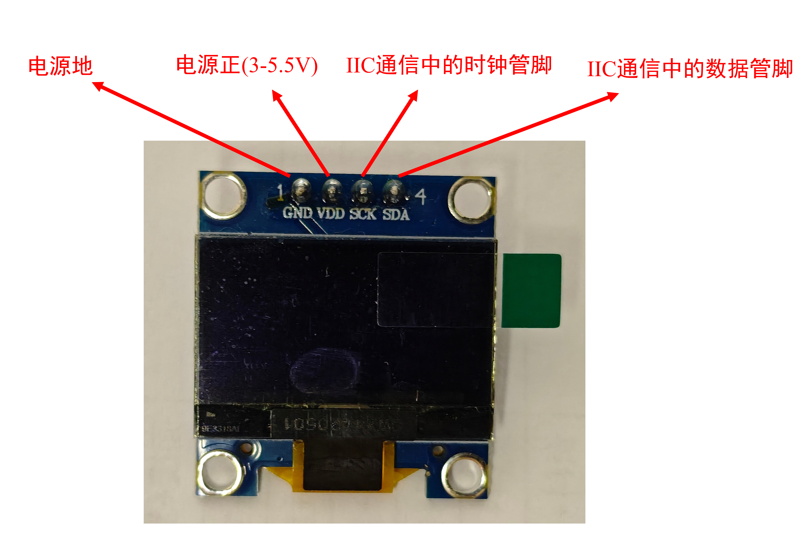{ width="600" }
</figure>

<figure markdown="span">
  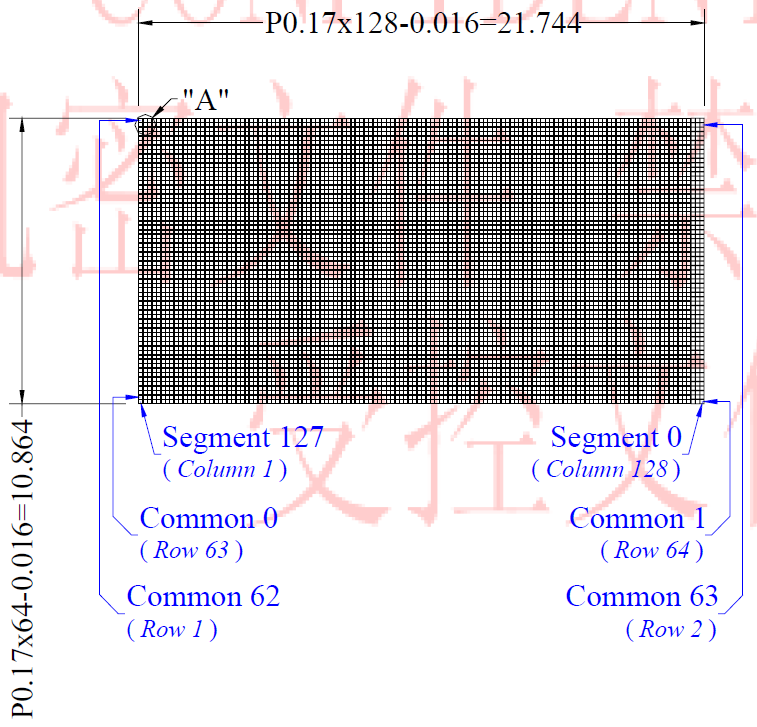{ width="500" }
</figure>


### SSD1306驱动IC的相关细节

下图为SSD1306的内部结构图。观察该图可以发现，在SSD1306中存在着一个128x64bit大小的GDDRAM(Graphic Display Data RAM)。本质上，其就是一个SRAM。该SRAM中的每一个bit对应一颗像素点。如果显存中的某个bit为1，则它对应的那颗像素OLED被点亮，否则是熄灭的。
<figure markdown="span">
  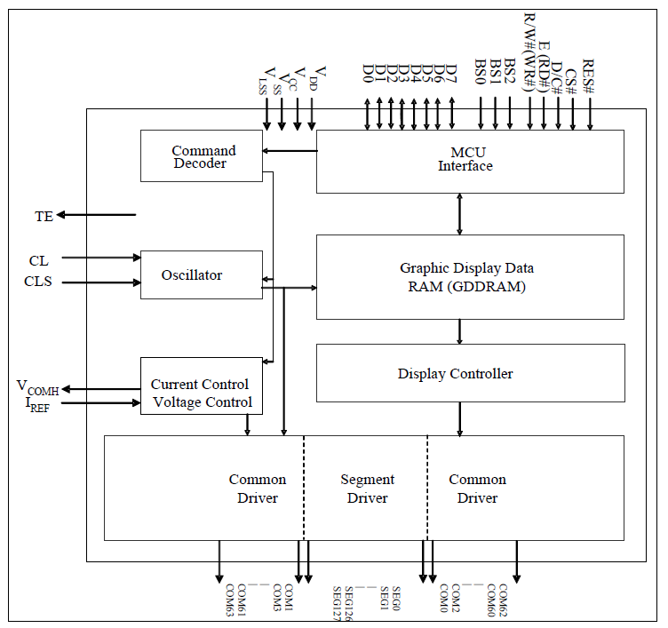{ width="600" }
</figure>

GDDRAM被划分为了8个Page(PAGE0-PAGE7)，一个PAGE中含有128个SEG。一个SEG中存放一字节的数据。低位在上部，而高位在底部。此外，通过改变寄存器配置可改变GDDRAM的行/列地址与OLED面板实际物理像素行/列的对应关系。如下图所示。
<figure markdown="span">
  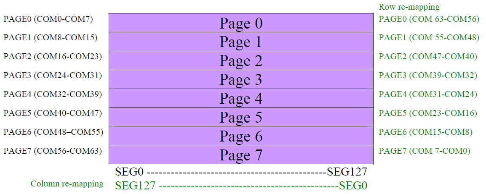{ width="700" }
</figure>

<figure markdown="span">
  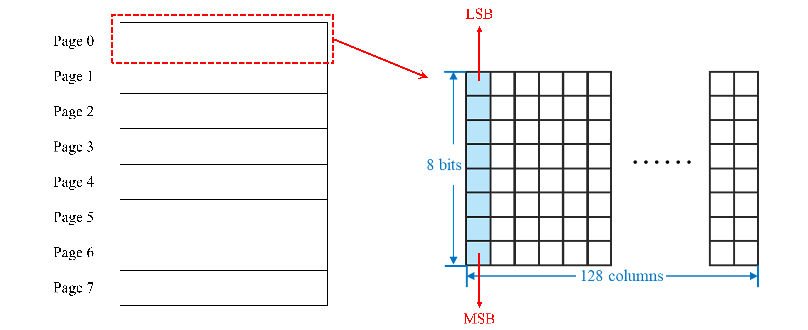{ width="700" }
</figure>


### I2C介绍

#### 概述

I2C(Inter-Integrated Circuit)利用两根线来进行串口通信。这两根线分别为串口数据线(SDA, serial data line)和串口时钟线(SCL, serial clock line)。I2C支持多个设备挂靠在传输总线上，并且支持多个控制器接受或发送数据。传输数据时通过设备地址来分辨究竟是哪一个设备参与I2C。

#### 传输模式

I2C有多种传输速度模式，按照出现的先后顺序可分为如下的5种模式：

* Standard-mode: 100kbps(kbps即kilobits per second)
* Fast-mode: 400kbps
* Fast-mode Plus: 1Mbps
* High-speed mode: 3.4Mbps
* Ultra-Fast mode: 5Mbps

#### 硬件结构

<figure markdown="span">
  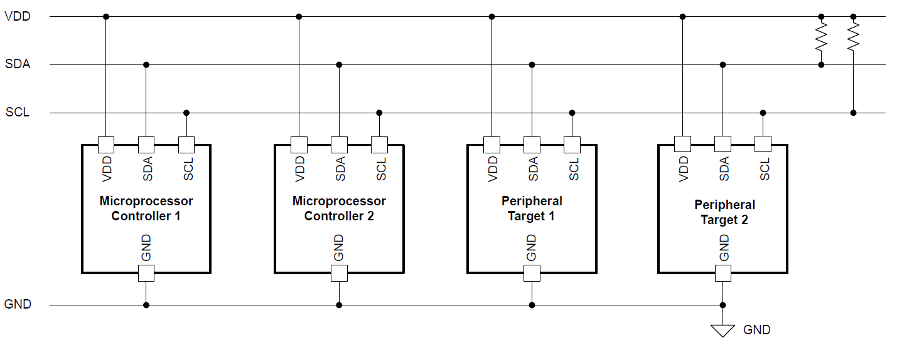{ width="700" }
</figure>
上图为一个典型的I2C通信的实施方法。SCL用于传输串口通信的时钟信号，而SDA用于传输串口通信的数据信号。在一个时刻，只有总线上的一个设备或控制器传输数据。I2C总线上所有设备的SDA和SCL引脚输出驱动都为开漏(Open-Drain)结构，通过外接上拉电阻实现总线上所有节点的SDA和SCL信号的线与逻辑关系，如下图所示。
<figure markdown="span">
  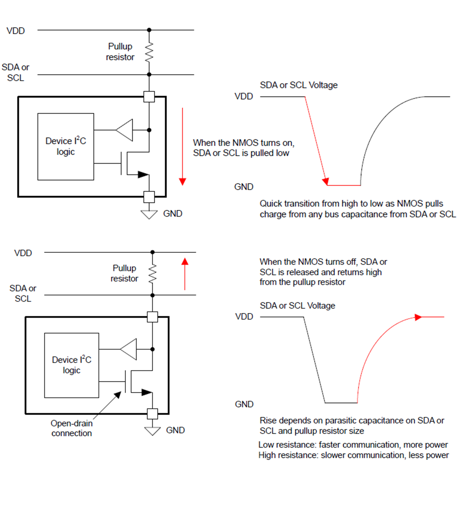{ width="600" }
</figure>
当NMOS开启时，SDA与SCL直接与GND相连，输出低电平。当NMOS关闭时，SDA与SCL被拉高至高电平。上拉电阻的存在使得SDA与SCL要么是高电平，要么是低电平。

下图显示了在I2C中使用开漏输出模式(Open-Drain Output)与推挽输出模式(Push-Pull Output)的对比图。
<figure markdown="span">
  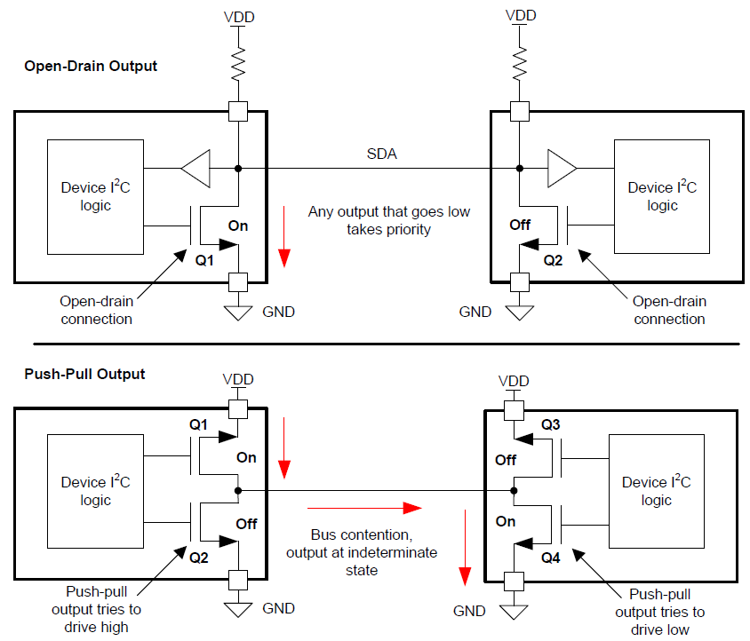{ width="600" }
</figure>

对于推挽输出模式，若在总线上活动的两个设备一个输出高电平，而另一个输出低电平，则会导致VDD与GND之间直接被短路。
#### 通讯内容

I2C通信开始的信号是首先拉低SDA，然后再拉低SCL。而通信结束的信号是首先拉高SCL，然后再拉高SDA。如下图所示。
<figure markdown="span">
  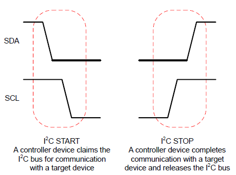{ width="400" }
</figure>

对于I2C通信的整个过程可使用如下的示意图简要的进行概括。首先拉低SDA，然后再拉低SCL。这是I2C通信开始的标志。随后，通过SDA传输7位从机的地址。需要注意的是SCL为高电平时，SDA上的数据必须保持稳定，以便接收方能够准确进行采样。SCL为低电平时，SDA线上的数据才允许发生变化，为下一个比特的传输做好准备。紧随者7位地址位的是读写位。该位表示读写的方向。该位为0时，表示写入从机。该位为1时，表示读取从机。在读写位后是应答位(ACK)，用以确认接受是否成功。当完成上述的操作后，开始传输数据。每一个数据帧为8位，同样在每个字节后都紧跟一个应答位(ACK)。数据传输时，高位在前。当完成数据传输后，首先拉高SCL，然后再拉高SDA，I2C通信结束。

<figure markdown="span">
  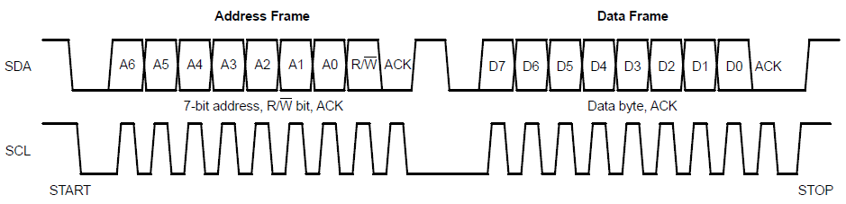{ width="800" }
</figure>

### 利用OLED屏进行显示细节

下图为OLED屏与STM32的连接示意图。在这之中，GND端口接B6端口，VDD端口接B7端口，SCK端口接B8端口，而SDA端口接B9端口。
<figure markdown="span">
  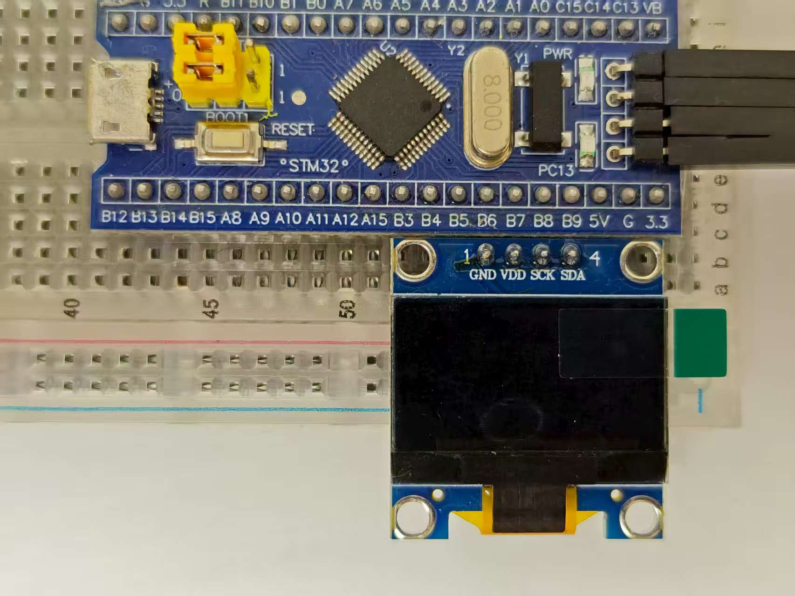{ width="500" }
</figure>

#### 引脚初始化

```C
#define OLED_W_SCL(x)		GPIO_WriteBit(GPIOB, GPIO_Pin_8, (BitAction)(x))  // 设置或清除指定的数据端口位
#define OLED_W_SDA(x)		GPIO_WriteBit(GPIOB, GPIO_Pin_9, (BitAction)(x))


void OLED_I2C_Init(void)
{
  RCC_APB2PeriphClockCmd(RCC_APB2Periph_GPIOB, ENABLE);   // 开启APB2外设时钟
	
	GPIO_InitTypeDef GPIO_InitStructure;
 	GPIO_InitStructure.GPIO_Mode = GPIO_Mode_Out_OD;      // 开漏输出
	GPIO_InitStructure.GPIO_Speed = GPIO_Speed_50MHz;     // 最高输出速率
	GPIO_InitStructure.GPIO_Pin = GPIO_Pin_8;             // 选中管脚
 	GPIO_Init(GPIOB, &GPIO_InitStructure);
	GPIO_InitStructure.GPIO_Pin = GPIO_Pin_9;             // 选中管脚
 	GPIO_Init(GPIOB, &GPIO_InitStructure);
	
	OLED_W_SCL(1);     // 拉高SCL
	OLED_W_SDA(1);     // 拉高SDA
}
```
上述的GPIO端口采用了**开漏输出**模式。开漏模式在输出高电平时实际输出高阻态。当I2C该总线上的所有设备都输出高阻态时，由外部的上拉电阻上拉为高电平。此外，当STM32的GPIO配置成开漏输出模式时，它仍然可以通过读取GPIO的输入数据寄存器获取外部对引脚的输入电平。**规定空闲状态下，SDA与SCL都必须拉高，即SDA与SCL都为高电平。**

#### I2C开始
```C
void OLED_I2C_Start(void)
{
	OLED_W_SDA(1);  // 拉高SDA
	OLED_W_SCL(1);  // 拉高SCL
	OLED_W_SDA(0);  // 拉低SDA
	OLED_W_SCL(0);  // 拉低SCL
}
```

#### I2C结束
```C
void OLED_I2C_Stop(void)
{
	OLED_W_SDA(0);  // 拉低SDA
	OLED_W_SCL(1);  // 拉高SCL
	OLED_W_SDA(1);  // 拉高SDA
}
```

#### I2C传输一个字节数据
```C
void OLED_I2C_SendByte(uint8_t Byte)
{
	uint8_t i;
	for (i = 0; i < 8; i++)
	{
		OLED_W_SDA(!!(Byte & (0x80 >> i)));  // 0x80: 1000 0000, 依次从高位开始提取出每一位
		OLED_W_SCL(1);   // SCL拉高，开始数据采样
		OLED_W_SCL(0);   // SCL拉低，数据采样结束，准备对下一位数据进行采样
	}
	OLED_W_SCL(1);	//额外的一个时钟，不处理应答信号
	OLED_W_SCL(0);
}
```

#### OLED写指令
```C
void OLED_WriteCommand(uint8_t Command)
{
	OLED_I2C_Start();
	OLED_I2C_SendByte(0x78);		//从机地址 0111 1000
	OLED_I2C_SendByte(0x00);		//写命令 0000 0000
	OLED_I2C_SendByte(Command); 
	OLED_I2C_Stop();
}
```

* **从机地址**在启动信号后的**第一个字节**开始传输。从机收到自己的地址后才能发送应答信号表示自己在线。模块的I2C从机地址为：**0111 10 [SA0] [RW]**。SA0是硬件地址选择位。当SA0接高电平时，地址中的SA0就是1，当SA0接低电平时，地址中的SA0就是0。模块出厂时，一般SA0是接低电平。RW为读写位。0表示写，而1表示读。
* **第二个字节**传输**控制字节**。控制位的格式为：**[Co] [D/C#] [000000]**。通过控制字节中的D/C#位来确定接下来发送的一个字节是指令还是数据。发送指令该位为0，发送数据该位为1。当Co=0，并且D/C#=1时，接下来可以连续发送任意多个显存数据字节，直至产生停止信号。
* **第三个字节**传输**单字节指令/数据**。

#### OLED写数据
```C
void OLED_WriteData(uint8_t Data)
{
	OLED_I2C_Start();
	OLED_I2C_SendByte(0x78);		//从机地址 0111 1000
	OLED_I2C_SendByte(0x40);		//写数据 0100 0000
	OLED_I2C_SendByte(Data);
	OLED_I2C_Stop();
}
```
此时控制字节中的D/C#变为1。

* **D/C#为0**，代表传输的是指令相关的数据，主要用于改变屏幕的工作参数。
* **D/C#为1**，代表传输的是数据，主要用于显示数据。

#### 设置OLED光标位置
```C
// Y 以左上角为原点，向下方向的坐标
// X 以左上角为原点，向右方向的坐标
void OLED_SetCursor(uint8_t Y, uint8_t X)
{
	OLED_WriteCommand(0xB0 | Y);					//设置Y位置:0~7, 传入页地址
	OLED_WriteCommand(0x10 | ((X & 0xF0) >> 4));	//设置X位置高4位:0~127，传入列地址
	OLED_WriteCommand(0x00 | (X & 0x0F));			//设置X位置低4位，传入列地址
}
```
<figure markdown="span">
  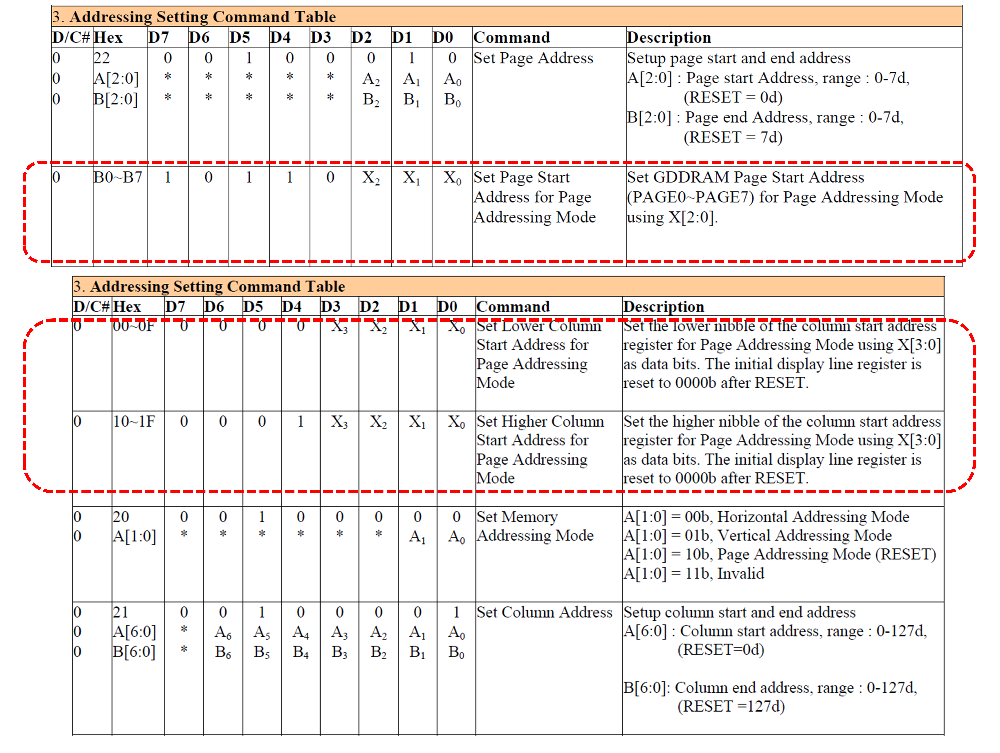{ width="800" }
</figure>

#### OLED清屏
```C
void OLED_Clear(void)
{  
	uint8_t i, j;
	for (j = 0; j < 8; j++)        // 遍历每一行
	{
		OLED_SetCursor(j, 0);
		for(i = 0; i < 128; i++)   // 遍历每一列
		{
			OLED_WriteData(0x00);
		}
	}
}
```

#### OLED初始化
```C
void OLED_Init(void)
{
	uint32_t i, j;
	
	for (i = 0; i < 1000; i++)			//上电延时
	{
		for (j = 0; j < 1000; j++);
	}
	
	OLED_I2C_Init();			//端口初始化
	
	OLED_WriteCommand(0xAE);	//关闭显示
	
	OLED_WriteCommand(0xD5);	//设置显示时钟分频比/振荡器频率
	OLED_WriteCommand(0x80);
	
	OLED_WriteCommand(0xA8);	//设置多路复用率
	OLED_WriteCommand(0x3F);
	
	OLED_WriteCommand(0xD3);	//设置显示偏移
	OLED_WriteCommand(0x00);
	
	OLED_WriteCommand(0x40);	//设置显示开始行
	
	OLED_WriteCommand(0xA1);	//设置左右方向，0xA1正常 0xA0左右反置
	
	OLED_WriteCommand(0xC8);	//设置上下方向，0xC8正常 0xC0上下反置

	OLED_WriteCommand(0xDA);	//设置COM引脚硬件配置
	OLED_WriteCommand(0x12);
	
	OLED_WriteCommand(0x81);	//设置对比度控制
	OLED_WriteCommand(0xCF);

	OLED_WriteCommand(0xD9);	//设置预充电周期
	OLED_WriteCommand(0xF1);

	OLED_WriteCommand(0xDB);	//设置VCOMH取消选择级别
	OLED_WriteCommand(0x40);

	OLED_WriteCommand(0xA4);	//设置整个显示打开/关闭

	OLED_WriteCommand(0xA6);	//设置正常/倒转显示 A6为1亮0灭，而A7为0亮1灭

	OLED_WriteCommand(0x8D);	//设置充电泵
	OLED_WriteCommand(0x14);

	OLED_WriteCommand(0xAF);	//开启显示
		
	OLED_Clear();				//OLED清屏
}
```
OLED的初始化流程如下：

* 上电延时，确保OLED电源稳定。
* 关闭显示。发送命令`0xAE`，使OLED进入休眠，防止初始化过程中出现杂乱像素。
* 设置时钟分频和振荡频率。首先发送命令`0xD5`，然后再发送命令`0x80`。  
<figure markdown="span">
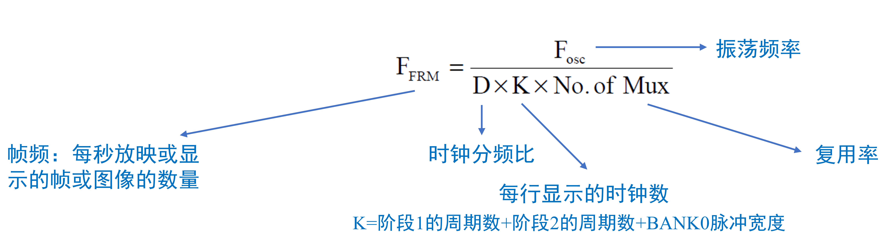{ width="600" }
</figure>

<figure markdown="span">
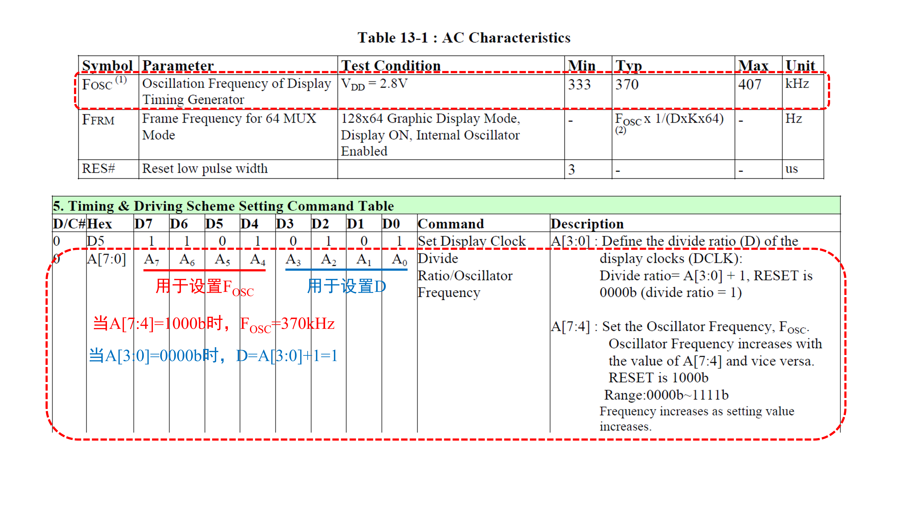{ width="800" }
</figure>

<figure markdown="span">
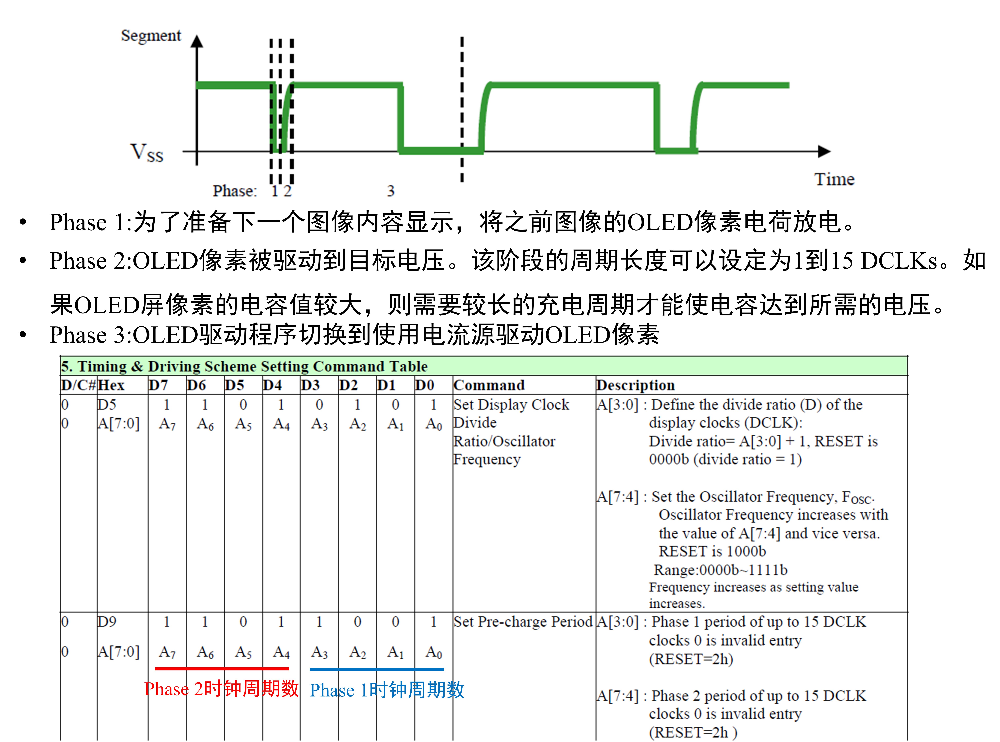{ width="700" }
</figure>

<figure markdown="span">
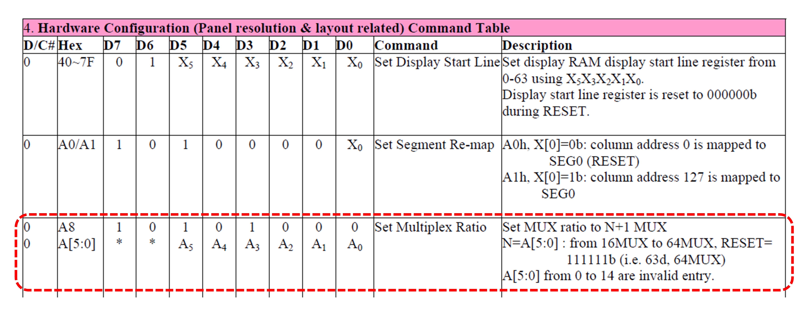{ width="700" }
</figure>

若按照默认值计算，则K=2+2+50=54。按照帧频的计算公式可以求得FFRM = 370k / (1x54x64) = 107.06Hz，也就是每秒扫描107次。

* 设置多路复用比。首先发送命令`0xA8`，然后再发送命令`0x3F`。 对于128x64 OLED，高度为64像素，对应MUX比为`0x3F`（也就是63，表示驱动0-63行）。
* 设置显示偏移。首先发送命令`0xD3`，然后再发送`0x00`，表示起始行偏移设为0。
* 设置显示开始行。发送命令`0x40`。
* 列地址重映射。`0xA1`正常，`0xA0`左右反置。
* 行地址重映射。`0xC8`正常，`0xC0`上下反置。
* 设置COM引脚配置。首先发送命令`0xDA`，然后再发送`0x12`。
* 设置对比度。首先发送命令`0x81`，然后再发送`0x7F`(范围为`0x00~0xFF`)。可根据需要调亮或调暗。
* 设置预充电周期。首先发送命令`0xD9`，然后再发送`0xF1`(在使用内部电荷泵时，`0xF1`是推荐值)。
* 设置VCOMH除数。首先发送命令`0xDB`，然后再发送`0x40`。
* 整个显示开启。发送命令`0xA4`
* 设置正常/反向显示。若发送命令`0xA6`，则为正常模式(为1，则OLED亮，为0，则OLED灭)。若发送命令`0xA7`，则为反相显示。
* 启用电荷泵。首先发送命令`0x8D`，再发送命令`0x14`。
* 点亮OLED，开始显示。发送命令`0xAF`。

### 相关例子
#### 单个汉字的显示
为理解OLED显示汉字的原理，首先使用matplotlib来模拟OLED发光。涉及到的Python函数代码如下(每个汉字字模的大小为16x16)：
```py
import numpy as np
import  matplotlib.pyplot as plt
import scienceplots
from matplotlib.ticker import MultipleLocator

plt.style.use(['no-latex','my'])

def Convert_array_China(data: list):
    array_ls_1 = []       # 存储汉字的上半部分数据，即前16字节
    array_ls_2 = []       # 存储汉字的下半部分数据，即后16字节
    for d in range(0,16):
        ls_1 = []
		ls_2 = []
        for i in range(8):
            ls_1.append((int(data[d], 16)>>i)&(0x1))
			ls_2.append((int(data[d+16], 16)>>i)&(0x1))    # 依次提取出每一位
        array_ls_1.append(ls_1)
		array_ls_2.append(ls_2)
    return np.concatenate((np.array(array_ls_1).T, np.array(array_ls_2).T))   # 矩阵转置并堆叠

def Draw_China(data: np.ndarray):
    fig, ax = plt.subplots(figsize=(4, 4))
    ax.imshow(data, origin='upper')
    ax.tick_params(top=True, labeltop=True, bottom=False, labelbottom=False)
    ax.xaxis.set_major_locator(MultipleLocator(1))
    ax.yaxis.set_major_locator(MultipleLocator(1))
    for i in range(1,32,2):
        plt.axhline(y=0.5*i)
    for i in range(1,32,2):
        plt.axvline(x=0.5*i)
    plt.show()
```
若需要显示汉字"你"，则通过取字模软件获得该汉字对应的编码后，即可以利用如下的Python代码模拟OLED发光。
```py
ls = "0x00,0x80,0x60,0xF8,0x07,0x40,0x20,0x18,0x0F,0x08,0xC8,0x08,0x08,0x28,0x18,0x00,0x01,0x00,0x00,0xFF,0x00,0x10,0x0C,0x03,0x40,0x80,0x7F,0x00,0x01,0x06,0x18,0x00".split(",")
Draw_China(Convert_array_China([d.replace("0x", "") for d in ls]))
```
可以得到如下的图像。
<figure markdown="span">
  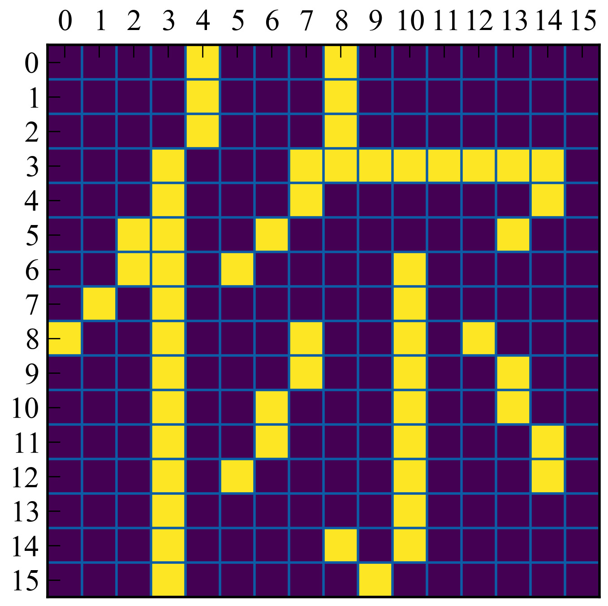{ width="200" }
</figure>

在上面的基础上，可通过下面的C语言函数实现OLED展示单个汉字。
```C
/**
  * @brief  OLED显示一个中文字符
  * @param  Line 行位置，范围：1~4
  * @param  Column 列位置，范围：1~8
  * @param  Index 该中文字符在字模库中的索引值
  * @retval 无
  */
void OLED_ShowCharChina(uint8_t Line, uint8_t Column, uint8_t Index)
{      	
	uint8_t i;
	OLED_SetCursor((Line - 1) * 2, (Column - 1) * 16);		//设置光标位置在上半部分
	for (i = 0; i < 16; i++)
	{
		OLED_WriteData(OLED_F16x16[Index][i]);			//显示上半部分内容
	}
	OLED_SetCursor((Line - 1) * 2 + 1, (Column - 1) * 16);	//设置光标位置在下半部分
	for (i = 0; i < 16; i++)
	{
		OLED_WriteData(OLED_F16x16[Index][i + 16]);		//显示下半部分内容
	}
}
```
主程序代码如下所示。
```C
#include "stm32f10x.h"                
#include "Delay.h"
#include "OLED.h"
#include <stdio.h>

int main(void)
{
	OLED_Init();		
	OLED_ShowCharChina(2, 2, 0);
	while(1)
	{
	}
}
```
<figure markdown="span">
  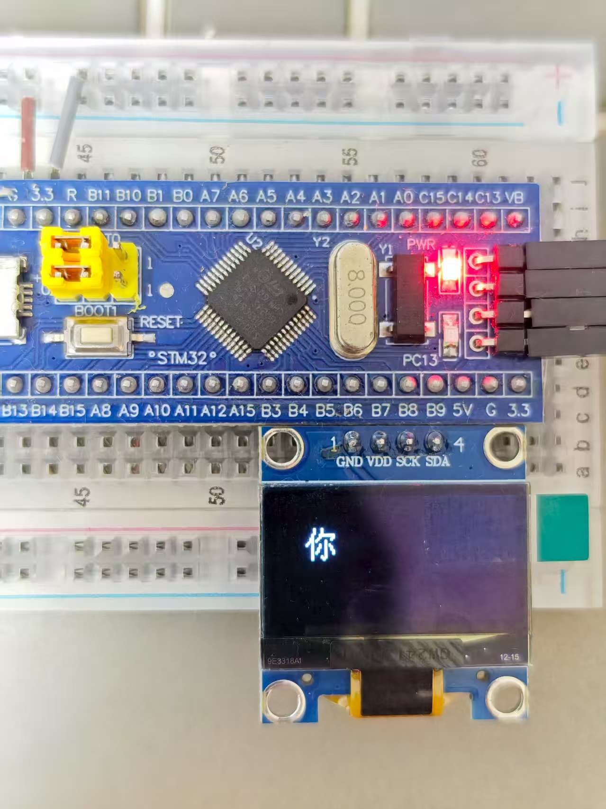{ width="300" }
</figure>

#### 句子的显示
可通过下面的C语言函数实现OLED展示句子。
```C
/**
  * @brief  OLED显示字符串
  * @param  Line 起始行位置，范围：1~4
  * @param  Column 起始列位置，范围：1~8
  * @param  Index 要显示的中文字符在字模库中的数组
  * @param  Len 数组的长度，范围：1~8
  * @retval 无
  */
void OLED_ShowStringChina(uint8_t Line, uint8_t Column, uint8_t Index[], uint8_t Len)
{
	uint8_t i;
	for (i = 0; i < Len; i++)
	{
		OLED_ShowCharChina(Line, Column + i, *(Index+i));
	}
}
```
<figure markdown="span">
  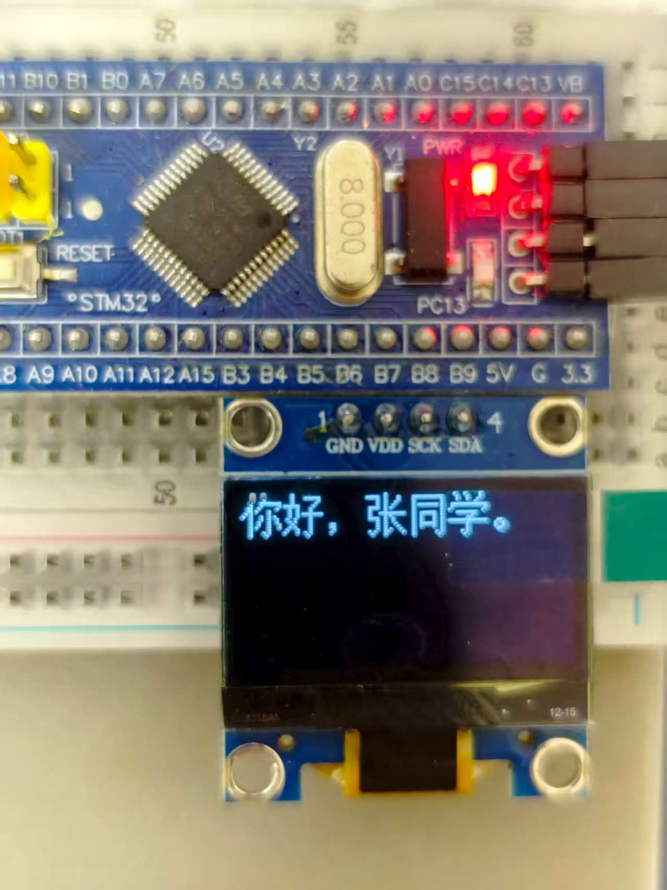{ width="300" }
</figure>