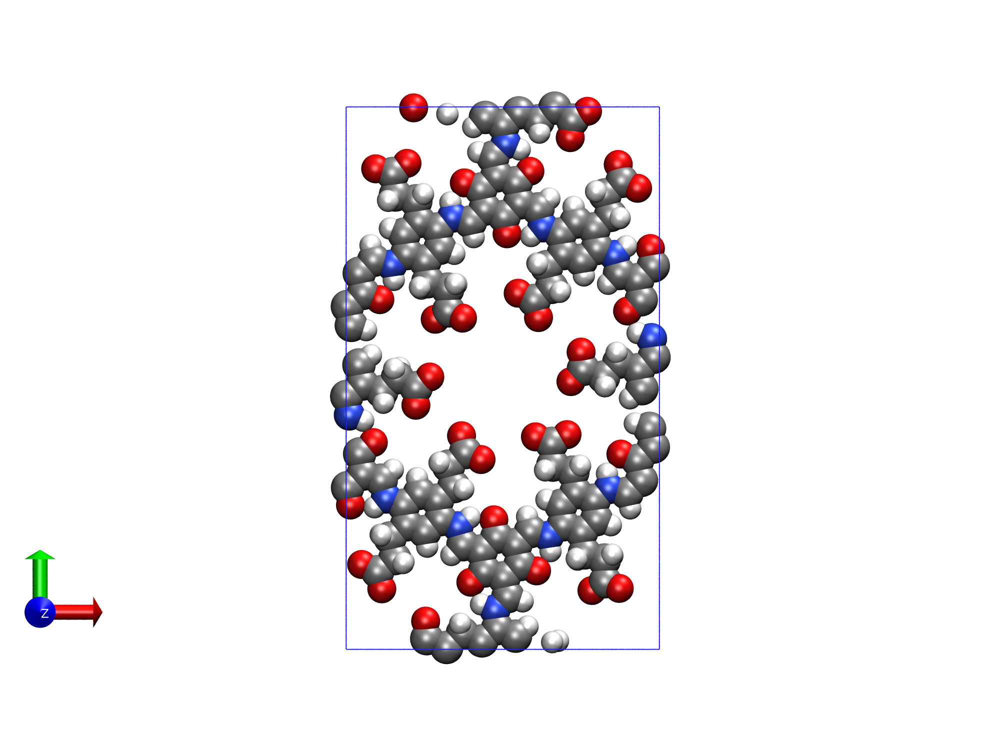
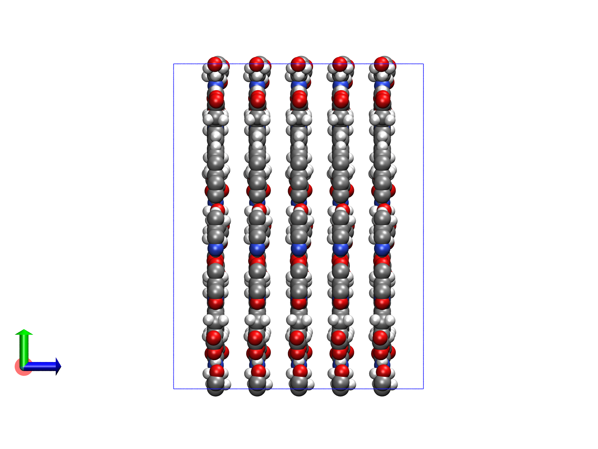
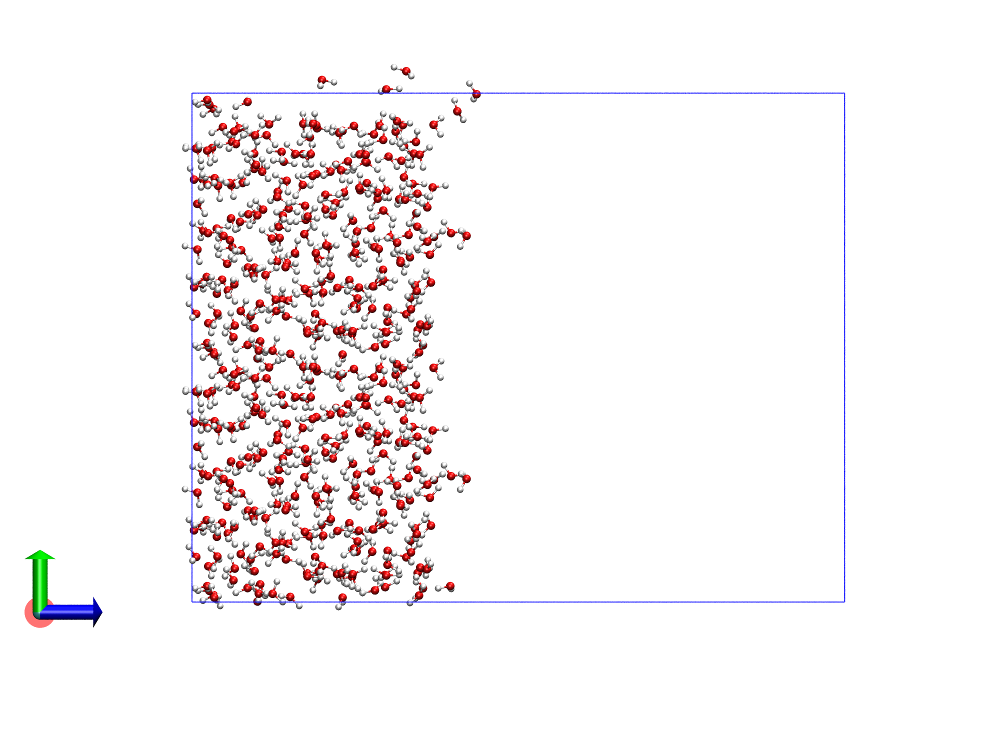
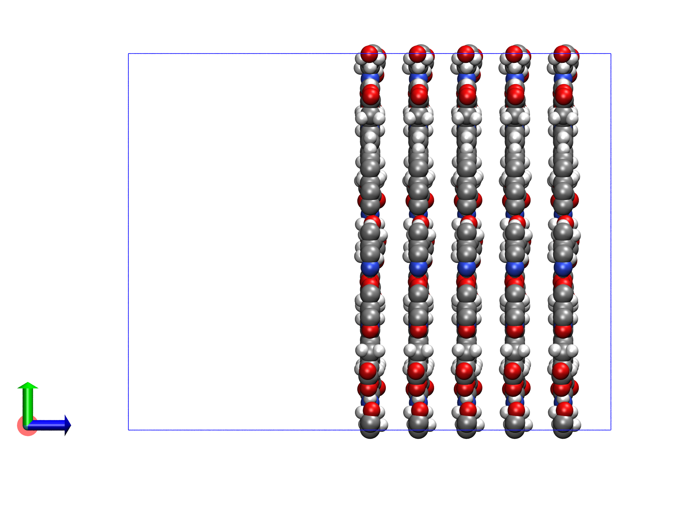
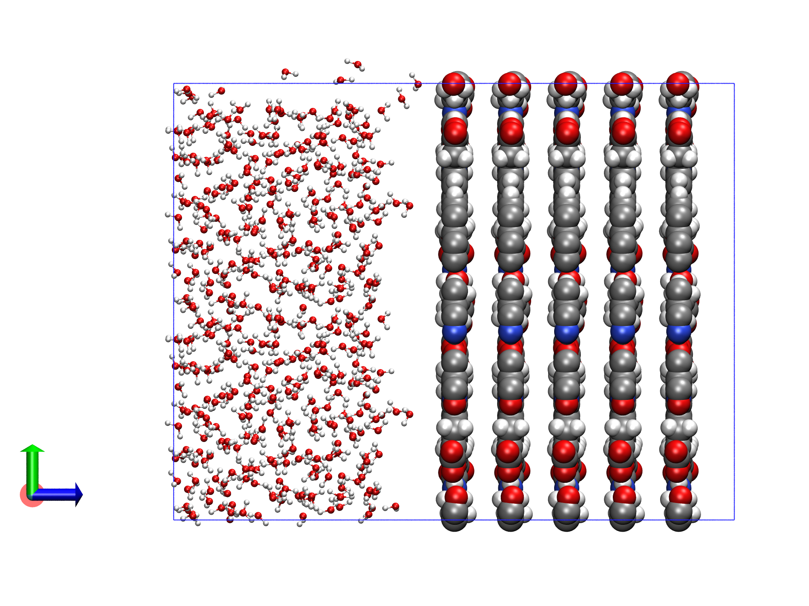
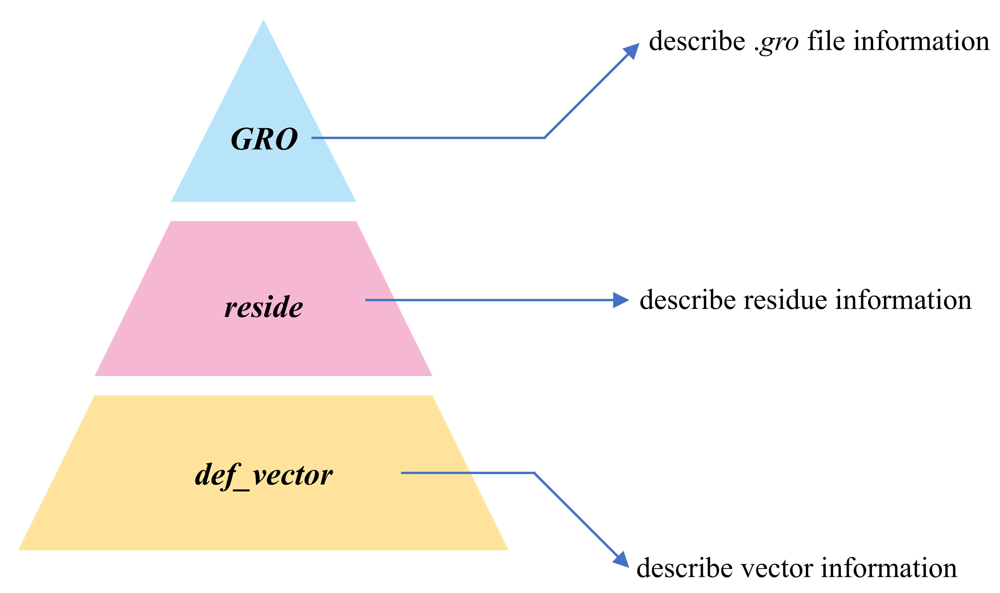
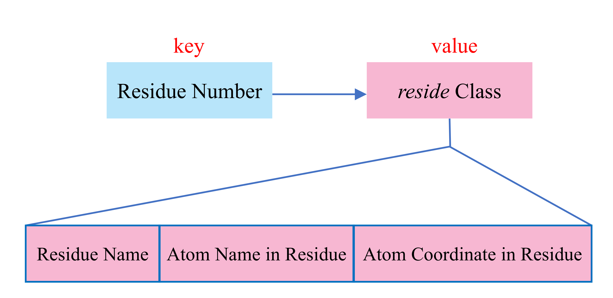
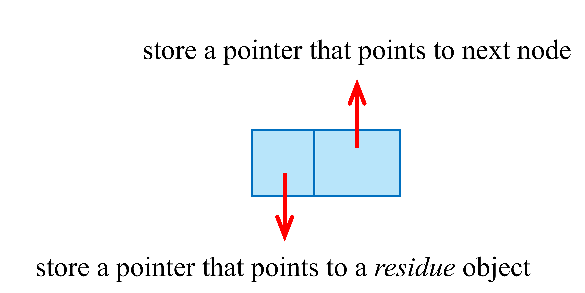
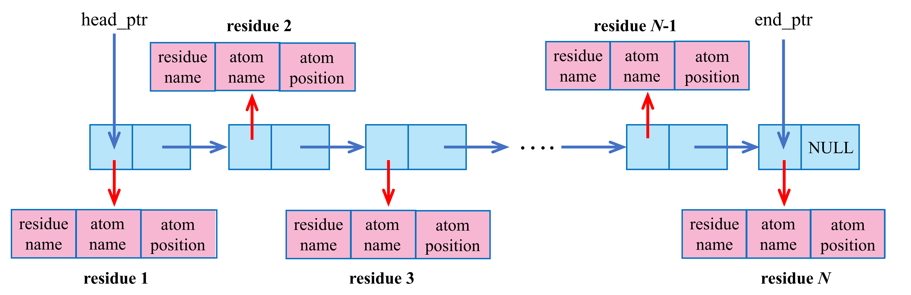

---
categories:
    - Computational Chemistry
date: 2025-04-26
tags:
    - Computational Chemistry
    - Molecular Dynamics Simulation
comments: true
slug: modGro_usage/
---

# modGro的使用方法

本篇文章主要用于说明modGro的使用方法。

<!-- more -->

### modGro的简要介绍

modGro是专门用于处理GROMACS生成的gro文件的工具。modGro可在其[主页](https://github.com/luck19990920/Scripts/tree/master/modGro){:target="_blank"}上进行下载。下载得到的文件夹中，`modGro`是在Linux系统中的可执行文件，`modGro.exe`为在Windows系统中的可执行文件。modGro支持修改gro文件中特定的残基名和原子名、删除特定的残基、复制特定的残基、对残基进行平移和合并多个gro文件等操作。文中涉及到的文件可在[此处](./files.zip)下载。

### modGro的主要功能

将gro文件载入modGro后，会出现如下的菜单选项。
```
 1 Show residue information
 2 Modify the residue or atom names
 3 Translate selected residues according to a translation vector
 4 Clone residues         5 Remove residues
 6 Set cell information
 7 Merge multiple .gro file
 8 Display the coordinate range of the selected residue
 9 Output current structure to .gro file
```
下面将逐一的讲解各选项的含义。

* 选项`1 Show residue information`

该选项主要用于将gro文件中的内容(除了原子个数信息和盒子信息以外的部分)展示在屏幕上，便于检查。键入`1`即可进入该选项。进入该选项后，键入不同的数字则可以用不同的方式筛选出需要展示在屏幕上的残基或原子的信息。例如，键入`1`则可以将gro文件中所有的残基信息展示在屏幕上，键入`2`则可以将gro文件中特定序号的残基(残基的序号从1开始)信息展示在屏幕上，而键入`3`则可以将gro文件中特定序号的原子(原子的序号从1开始)信息展示在屏幕上。

* 选项`2 Modify the residue or atom names`
  
该选项主要用于修改gro文件中特定的残基名或原子名。键入`2`即可进入该选项。进入该选项后，键入不同的数字则可对特定序号的残基名或原子名进行修改。

* 选项`3 Translate selected residues according to a translation vector`
  
该选项主要用于将gro文件中特定的残基进行平移的操作。

* 选项`4 Clone residues`
  
该选项主要用于将gro文件中特定的残基进行复制。复制得到的残基还在其原位置。因此，对残基进行复制操作后往往需要对残基进行平移操作。

* 选项`5 Remove residues`
  
该选项与选项`4`相对，主要用于将gro文件中特定的残基进行删除。

* 选项`6 Set cell information`
  
该选项主要用来修改盒子的大小。键入`6`后即可进入该选项。随后需依次输入确定盒子大小的三个矢量。

* 选项`7 Merge multiple .gro file`
  
该选项主要用来合并多个gro文件。

* 选项`8 Display the coordinate range of the selected residue`
  
该选项主要用来计算得到特定残基中原子坐标在x/y/z方向上的最大值与最小值。

* 选项`9 Output current structure to .gro file`
  
该选项主要用来输出信息至gro文件中

### 相关例子

* 例子1：修改特定残基的残基名与残基中的原子名
  
`solv.gro`为一个含有528个水分子的gro文件。打开modGro后，依次键入如下的内容(`//`后的是注释)可以将1,2,9-30号残基的名字改为`MOL`。
```
solv.gro                 // 载入solv.gro
2                        // 修改残基名或原子名
1                        // 修改残基名
1,2,9-30                 // 需要修改的残基序号为1,2,9-30(残基序号从1开始)
MOL                      // 修改的残基名为MOL
0                        // 返回主菜单
9                        // 输出gro文件
C:\Users\fix-1.gro       // 输出到C:\Users\fix-1.gro
q                        // 退出程序
```
此时，序号为1,2,9-30的残基的残基名已经由`SOL`被修改为`MOL`。修改后的结构被保存到`fix-1.gro`文件中。

还是对于`solv.gro`文件，打开modGro后，依次键入如下的内容可以将1,10,18-20号残基中的第一个原子的原子名修改为`HA`。
```
solv.gro                 // 载入solv.gro
2                        // 修改残基名或原子名
2                        // 修改原子名
2                        // 根据残基序号进行修改
1,10,18-20               // 需要修改的残基序号为1,10,18-20(残基序号从1开始)
1                        // 修改残基中的第一个原子的原子名
HA                       // 修改成的原子名为HA
0                        // 返回主菜单
9                        // 输出gro文件
C:\Users\fix-2.gro       // 输出到C:\Users\fix-2.gro
q                        // 退出程序
```
此时，序号为1,10,18-20的残基中的第一个原子的原子名已经由`OW`被修改为`HA`。修改后的结构被保存到`fix-2.gro`文件中。

* 例子2：将单层COF结构拓展成多层COF结构

`COF.gro`为某一COF材料的gro文件(如下图所示)。我们的目标是采用modGro将该单层COF结构拓展成5层COF结构，并且层与层之间的间距为5埃。
<figure markdown="span">
  { width="600" }
</figure>
首先，双击点开`modGro.exe`，然后将`COF.gro`拖进窗口中并回车。窗口中将显示如下的gro文件信息。
```
Cell information
In Angstrom:
Cell vector 1,  X=  22.50600  Y=   0.00000  Z=   0.00000  Norm=  22.50600
Cell vector 2,  X=   0.00000  Y=  38.98150  Z=   0.00000  Norm=  38.98150
Cell vector 3,  X=   0.00000  Y=   0.00000  Z=  10.00000  Norm=  10.00000
Cell angles:
  Alpha=  90.0000  Beta=  90.0000  Gamma=  90.0000 degree
  Total atoms:    240
Total residue:    1
```
上述的文件信息表明：该gro文件中的盒子是正交的，并且盒子的三边长分别为22.50600埃、38.98150埃和10.00000埃。盒子三边的三个夹角都为90度。该gro文件中的原子总数为240，有1个残基。
!!! note "小贴士"

    在Windows下，也可以不双击点开`modGro.exe`，而用鼠标左键将`COF.gro`放置到`modGro.exe`上面后放开鼠标左键。这样可以直接使`modGro.exe`载入`COF.gro`文件进行分析。在Linux下，可直接在命令行中输入`modGro test.gro`回车即可将`test.gro`载入`modGro`中。

在这里，操作思路是先将单层的COF结构复制4次，然后依次对这些单层的COF结构进行平移。为实现将单层的COF结构复制4次，首先键入`4`。然后再键入`1`即可对单层的COF膜复制一次。此时，屏幕上会显示残基个数和原子个数，如下所示。
```
Well done. The current number of residues is 2. The current number of atoms is 480.
```
按照上面的方法，再对1号残基复制3次即可得到5层COF结构。随后，对2号残基沿着z方向平移5埃，对3号残基沿着z方向平移10埃，对4号残基沿着z方向平移15埃，对5号残基沿着z方向平移20埃，并对盒子z方向上的尺寸进行适当的增加。执行该操作可键入如下的内容：
```
3                    // 对特定的残基进行平移操作
2                    // 对2号残基进行平移
0,0,5                // 平移的矢量为0,0,5(单位为埃)
3                    // 对特定的残基进行平移操作
3                    // 对3号残基进行平移
0,0,10               // 平移的矢量为0,0,10(单位为埃)
3                    // 对特定的残基进行平移操作
4                    // 对4号残基进行平移
0,0,15               // 平移的矢量为0,0,15(单位为埃)
3                    // 对特定的残基进行平移操作
5                    // 对5号残基进行平移
0,0,20               // 平移的矢量为0,0,20(单位为埃)
6                    // 修改盒子尺寸
22.50600,0,0         // 第一个轴对应的矢量为22.50600,0,0(单位为埃)
0,38.98150,0         // 第二个轴对应的矢量为0,38.98150,0(单位为埃)
0,0,30               // 第三个轴对应的矢量为0,0,30(单位为埃)
9                    // 输出gro文件
[回车]               // 输出到modGro.exe所在目录
q                    // 退出程序
```
此时，在`modGro.exe`所在目录下会生成`fix.gro`，该文件就是最终得到的gro文件。将该gro文件利用VMD可视化，如下图所示。此时COF结构已经由最初的1层拓展至5层，并且层与层之间的间隔为5埃。
<figure markdown="span">
  { width="500" }
</figure>

* 例子3：对多个gro文件进行合并

本例子将在例子2的基础上沿着z轴在COF结构的左侧添加水溶液。`solv.gro`为一个三边尺寸分别为22.50600，38.98150和20(单位为埃)的水盒子。首先，将`solv.gro`利用modGro把其z方向的盒子尺寸由20埃变为50埃(因为上述得到的`fix.gro`的z方向上的盒子尺寸为30埃)。执行该操作可键入如下的内容(`//`后的是注释)：
```
solv.gro                  // 载入solv.gro文件
6                         // 修改盒子尺寸
22.50600,0,0              // 第一个轴对应的矢量为22.50600,0,0(单位为埃)
0,38.98150,0              // 第二个轴对应的矢量为0,38.98150,0(单位为埃)
0,0,50                    // 第三个轴对应的矢量为0,0,50(单位为埃)
9                         // 输出gro文件
extend_solv.gro           // 输出到extend_solv.gro文件中
q                         // 退出程序
```
将`extend_solv.gro`可视化如下所示。
<figure markdown="span">
  { width="500" }
</figure>
随后，修改`fix.gro`的盒子信息，使其与上述的`extend_solv.gro`中的盒子信息保持一致，并且将COF结构整体沿着z方向平移20埃。执行该操作可键入如下的内容：
```
fix.gro                    // 载入fix.gro文件
6                          // 修改盒子尺寸
22.50600,0,0               // 第一个轴对应的矢量为22.50600,0,0(单位为埃)
0,38.98150,0               // 第二个轴对应的矢量为0,38.98150,0(单位为埃)
0,0,50                     // 第三个轴对应的矢量为0,0,50(单位为埃)
3                          // 对残基进行平移
[回车]                     // 对所有的残基进行平移
0,0,20                     // 平移的矢量为0,0,20(单位为埃)
4                          // 输出gro文件
extend_fix.gro             // 输出到extend_fix.gro文件中
q                          // 退出程序
```
将`extend_fix.gro`可视化如下所示。
<figure markdown="span">
  { width="500" }
</figure>
!!! info "注意"

    若采用modGro合并盒子尺寸不同的多个gro文件并且不在modGro中修改盒子的尺寸，最终得到的盒子尺寸为载入的第一个gro文件中的盒子尺寸。

最后，将`extend_solv.gro`与`extend_fix.gro`使用`modGro`进行合并。执行该操作可键入如下的内容：
```
extend_solv.gro              // 载入extend_solv.gro文件
7                            // 合并gro文件
extend_fix.gro               // 需要将extend_fix.gro进行合并
q                            // 退出输入
9                            // 输出gro文件
merge.gro                    // 输出到merge.gro文件中
q                            // 退出程序
```
将`merge.gro`可视化如下所示。
<figure markdown="span">
  { width="500" }
</figure>

### modGro以命令行的方式运行
为保证modGro能够以命令行的方式运行，首先需要将modGro的可执行文件所在的目录添加至环境变量中。添加方式如下：

* 对于Windows系统：打开控制面板→系统与安全→系统→高级系统设置→环境变量→将modGro的可执行文件所在的目录添加至系统变量下的Path中。
* 对于Linux系统：运行`vi ~/.bashrc`命令，将export PATH=$PATH:/sob/workspace添加至文件末尾。其中`/sob/workspace`为modGro可执行文件所在的目录，需根据实际情况进行调整。

完成上述的设置后，在Windows系统中任意目录下打开cmd(按Win+R键，然后输入`cmd`)后，键入`modGro`即可启动modGro。在Linux系统中任意目录下键入`modGro`即可启动modGro。modGro以命令行的方式运行可结合输入文件名，例如`modGro test.gro`。下面是以命令行方式运行modGro的两个例子。

#### 例1：采用modGro调整gro文件为规范的gro文件
gro文件中某几列的格式有特殊的要求。若不按照此要求组织gro文件，gromacs读取gro文件时将报错。下面的shell脚本实现了将目录下的所有gro文件规范化并输出。得到的以`-merge`结尾的gro文件即为modGro生成的规范的gro文件。

``` shell title="在Linux中运行的Shell脚本" 
#!/usr/bin/bash

file_extend="-merge"  

for file in *.gro 
do
    filename=${file%.*}  
    echo "$file"   >>  gro_file_1.txt 
    echo "9" >>  gro_file_1.txt 
    echo "./"$filename$file_extend".gro" >> gro_file_1.txt
    echo "r" >> gro_file_1.txt
done

sed '$s/.*/q/' gro_file_1.txt > gro_file_2.txt
rm gro_file_1.txt
mv gro_file_2.txt gro_file.txt 

modGro < gro_file.txt
rm gro_file.txt
echo "Convert successfully!"
```


``` shell title="在Windows的git中运行的Shell脚本" 
#!/usr/bin/bash

file_extend="-merge"  

for file in *.gro 
do
    filename=${file%.*}  
    echo "$file"   >>  gro_file_1.txt 
    echo "9" >>  gro_file_1.txt 
    echo "./"$filename$file_extend".gro" >> gro_file_1.txt
    echo "r" >> gro_file_1.txt
done

sed '$s/.*/q/' gro_file_1.txt > gro_file_2.txt
rm gro_file_1.txt
mv gro_file_2.txt gro_file.txt 

modGro.exe < gro_file.txt
rm gro_file.txt
echo "Convert successfully!"
```
#### 例2：合并多个gro文件
下面的脚本能将目录下的所有gro文件合并成merge.gro（默认所处理的gro文件盒子尺寸都是一致的）。
``` shell title="在Linux中运行的Shell脚本"
 #!/usr/bin/bash

for file in *.gro 
do
    echo "$file"   >>  gro_file.txt 
done

sed -i '1a 7' gro_file.txt
echo -e "q\n9" >> gro_file.txt
echo "./merge.gro" >> gro_file.txt
echo "q" >> gro_file.txt

modGro < gro_file.txt
rm gro_file.txt
echo "Merge successfully!"
```

``` shell title="在Windows的git中运行的Shell脚本" 
#!/usr/bin/bash

for file in *.gro 
do
    echo "$file"   >>  gro_file.txt 
done

sed -i '1a 7' gro_file.txt
echo -e "q\n9" >> gro_file.txt
echo "./merge.gro" >> gro_file.txt
echo "q" >> gro_file.txt

modGro.exe < gro_file.txt
rm gro_file.txt
echo "Merge successfully!"
```
### 附：对于modGro内部实现的一些说明
#### 2.0版本
(以下内容 2025-Mar-9更新)

modGro的实现过程中采用了面向对象编程(OOP)的方法。在这之中，存在三个类，并且这三个类是层层继承的关系。`reside`类中使用到了`def_vector`类的相关性质，而`GRO`类中使用到了`reside`类的相关性质，如下图所示。
<figure markdown="span">
  { width="500" }
</figure>
这三个类的作用如下：

* `def_vector`：三维矢量的类。矢量的平移、旋转以及矢量之间的夹角在此类中进行实现。
* `reside`：单个残基的类。`gro`文件中的每一个残基都为该类的一个实例。该类中有三个属性，分别为`resname`(该残基的残基名)、`atom_name_reside`(残基中的原子名数组)与`coordinate_reside`(残基中的原子坐标数组)。在这之中，`coordinate_reside`中的每一个元素都为`def_vector`实例。
* `GRO`：gro文件的类。该类主要用于将gro文件中的盒子信息、残基序号、残基名、原子名和原子坐标等信息组织起来。

`GRO`类中保存`gro`文件中的信息采用了关联数组(即**字典**)。键为残基的序号，而值为残基的信息。如下图所示。
<figure markdown="span">
  { width="500" }
</figure>

#### 2.1版本
(以下内容 2025-May-1更新)

2.1版本与2.0版本最大的区别在于`gro`文件中的信息采用**链表**进行存储。程序中所使用链表的节点结构如下图所示。
<figure markdown="span">
  { width="400" }
</figure>
链表的节点主要包括两个部分。前一个部分存储一个`reside`对象的指针，而后一个部分存储一个指向下一个节点的指针。这样，就形成了下面的链表结构。
<figure markdown="span">
  { width="800" }
</figure>
该链表的头节点由指针`head_ptr`所指，而尾节点由指针`end_ptr`所指。链表中每一个残基出现的先后顺序决定了其的残基序号。

此外，在2.1版本中采用了**动态内存分配**的方法。这提高了内存的利用效率。