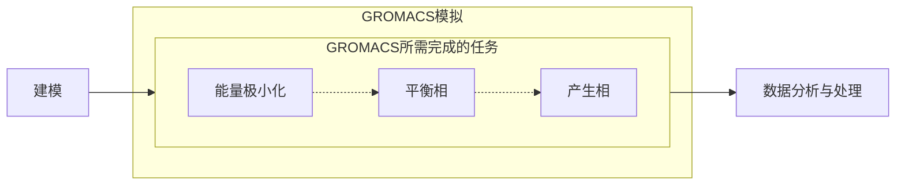

`GROMACS`是由荷兰格罗宁根大学开发，1991年发布最初版本。目前由瑞典皇家理工学院和乌普萨拉大学维护。`GROMACS`的官网为<a href="https://www.gromacs.org/" target="_blank">https://www.gromacs.org/</a>。分子动力学模拟的一般步骤如下：

### 建模
目前建模的方式主要有以下的几种方法：

* <strong>采用`Packmol`进行建模</strong>
  
  `Packmol`是一个免费的、构建分子动力学模拟初始结构的工具。关于`Packmol`的使用，可参考<a href="http://sobereva.com/473" target="_blank">分子动力学初始结构构建程序Packmol的使用</a>。另外，本网页也提供了<a href="../../file/Packmol user guide.pdf" target="_blank">`Packmol`使用手册</a>。

------
* <strong>采用`GROMACS`中的命令进行建模</strong>
  
  在`GROMACS`中，常用的进行建模的命令如下：

  1. `gmx solvate`命令：生成一个充满指定分子的盒子，默认添加的分子为SPC水分子。
   
     下面是一些例子：<br/>
     `gmx solvate -box 2 4 4 -o test.gro`：生成一个盒子长度为2 nm * 4 nm * 4 nm的被水填充的盒子，结构文件保存到`test.gro`<br/>
     `gmx solavte -cp CL.gro -o solv.gro`：将`CL.gro`空余部分用水分子进行填充，结构文件保存到`solv.gro`<br/>

  2. `gmx insert-molecules`命令：将指定分子插入体系空隙中，或填充一个填充指定分子的盒子。
    
     下面是一些例子：<br/>
     `gmx insert-molecules -f test.gro -ci CL.pdb -o out.gro -nmol 55`：在`test.gro`结构的空余部分填充55个`CL.pdb`，结构文件保存到`out.gro`

------
* <strong>采用VMD进行建模</strong>

  通常我们可以使用VMD对结构进行拼接，然后得到拼接之后的结构。

### `GROMACS`模拟

该部分主要包括能量极小化(简称em)、平衡相(简称eq)和产生相(简称prod)三个部分。

#### 能量极小化
能量极小化的目的是消除模型中严重不合理的接触。其有两种算法：最陡下降法与共轭梯度法。一般来说，对于难以能量极小化的体系建议先使用最陡下降法，然后再使用共轭梯度法。该步的`mdp`文件如下：
``` title="先采用最陡下降法"
define = -DFLEXIBLE
integrator = steep
nsteps = 10000
emtol  = 1000.0
emstep = 0.01
;
nstxout   = 100
nstlog    = 50
nstenergy = 50
;
pbc = xyz
cutoff-scheme            = Verlet
coulombtype              = PME
rcoulomb                 = 1.0
vdwtype                  = Cut-off
rvdw                     = 1.0
DispCorr                 = EnerPres
;
constraints              = none
```
``` title="再采用共轭梯度法"
define = -DFLEXIBLE
integrator = cg
nsteps = 10000
emtol  = 100.0
emstep = 0.01
;
nstxout   = 100
nstlog    = 50
nstenergy = 50
;
pbc = xyz
cutoff-scheme            = Verlet
coulombtype              = PME
rcoulomb                 = 1.0
vdwtype                  = Cut-off
rvdw                     = 1.0
DispCorr                 = EnerPres
;
constraints              = none
```
对于一般的体系，可直接使用共轭梯度算法，该步的`mdp`文件如下：
``` title="直接采用共轭梯度法"
define = -DFLEXIBLE
integrator = cg
nsteps = 10000
emtol  = 100.0
emstep = 0.01
;
nstxout   = 100
nstlog    = 50
nstenergy = 50
;
pbc = xyz
cutoff-scheme            = Verlet
coulombtype              = PME
rcoulomb                 = 1.0
vdwtype                  = Cut-off
rvdw                     = 1.0
DispCorr                 = EnerPres
;
constraints              = none
```
#### 平衡相
该步的目的是使体系达到充分的平衡。关于如何判断体系是否平衡，请看<a href="http://sobereva.com/627" target="_blank">谈谈怎么判断分子动力学模拟是否达到了平衡</a>。

#### 产生相
该步的目的是产生出能够被用来统计所需属性的数据与轨迹。换句话说，分子动力学模拟所需的数据全部在该步中完成取样。

!!! note "注意"
    能量极小化步骤请在虚拟机上完成。对于平衡相，若体系较小，建议在虚拟机中完成。若体系较大，建议在超算上完成。对于产生相，建议在超算中完成。

!!! info inline end "提示"

    `SubGmx.sh`运行每个任务用一张显卡和4个核。

在超算中，若需提交`GROMACS`计算任务，可使用`SubGmx.sh`命令。`SubGmx.sh`命令的使用方法如下：<br/>
`SubGmx.sh [name of .tpr file]`<br/>
`SubGmx.sh`后接一个参数，该参数为需要运行的`GROMACS`的`tpr`文件。`tpr`文件一般在虚拟机中生成。

### 数据分析与处理
对于一般的物理量，`GROMACS`中有自带的命令可以进行求解。较为常见的如下：

* `gmx msd`：计算均方位移
* `gmx rdf`：计算径向分布曲线和配位数曲线

更多的命令请看<a href="../../file/gmx-manual-2022.5.pdf" target="_blank">`GROMACS`手册</a>。
此外，还可利用VMD进行数据分析或Python库(例如<a href='https://www.mdanalysis.org/' target="_blank">MDAnalysis</a>)进行分析。