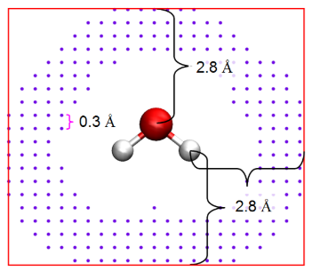

​RESP电荷是基于拟合静电势获得的一种原子电荷，其被广泛用于分子动力学模拟中。<a href='http://sobereva.com/multiwfn/' target='_blank'>Multiwfn</a>是由卢天开发的波函数分析程序。<a href='https://orcaforum.kofo.mpg.de/app.php/portal' target='_blank'>ORCA</a>是一款量子化学程序，使用人数仅次于Gaussian。本篇博文将详解利用ORCA与Multiwfn计算RESP电荷的Shell脚本，旨在为不熟悉Shell脚本的读者提供一个认识Shell脚本的机会。

---

### 对于RESP电荷的相关理解

RESP电荷是拟合静电势电荷中的一种。拟合静电势电荷通过使原子电荷能够尽可能重现基于波函数计算的分子范德华表面附近和外侧的静电势来得到。由于对这些区域的静电势重现性越好的原子电荷才能越好地通过经典的库伦定律描述分子间的静电相互作用。而拟合静电势电荷在原理上又是对静电势重现性最好的原子电荷，因此拟合静电势电荷被广泛应用在分子动力学模拟中。下面对拟合静电势电荷中几种典型的电荷进行说明。

#### 1.CHELPG(Charges from electrostatic potentials using a grid based method)电荷

<div style='text-align:center'></div>
<div style='text-align:center'>CHELPG电荷计算方法示意图</div>

首先，其定义了一个盒子，使得盒子距离其最近的原子的距离为2.8埃。并将点均匀的散在盒子中，每个点之间的距离为0.3埃。在实际计算中，只考虑距离原子最小距离大于原子范德华半径并且小于距离所有原子2.8埃以内的点。上图显示的点就是最后考虑的点。然后，我们调节每个原子上的电荷使得这些点上的静电势与波函数计算出的静电势尽可能接近。

#### 2.Merz-Kollmann(MK)电荷

MK电荷与CHELPG电荷的不同之处在于点的设置上。在MK电荷中，点平均分布在距离每个原子1.4、1.6、1.8和2.0倍范德华半径的层上。

#### 3.RESP(Restrained ElectroStatic Potential)电荷

由于静电势拟合点都分布在范德华表面附近及外侧一定区域中，因此对于包埋在内部的原子而言，它们距离拟合点较远，拟合的质量较低，数值的不确定性大。为解决这个问题，RESP电荷的拟合分为两步：

第一步：拟合电荷时使用惩罚函数对非氢原子施加弱限制(限制越强，原子电荷被拉低的倾向越明显)，不约束原子的等价性，所有原子的电荷都能被拟合。这一步允许原子电荷变化有最大自由度，以充分让极性原子尽可能好地拟合静电势。

第二步：拟合电荷时使用惩罚函数对非氢原子施加强限制，只允许sp<sup>3</sup>杂化的碳、亚甲基的碳，以及它们上面的氢的电荷被拟合，而其他原子的电荷保持上一步最后的状态。拟合过程中考虑原子的等价性。

------

### 脚本代码解读

```shell
# A script to calculate RESP charge based on ORCA and Multiwfn
# Written by Tian Lu (sobereva@sina.com), last update: 2022-Mar-8
# Examples:
# Calculating neutral singlet molecule in water: RESP_ORCA.sh H2O.xyz
# Calculating anionic singlet molecule in water: RESP_ORCA.sh ani.pdb -1 1
# Calculating neutral triplet molecule in ethanol: RESP_ORCA.sh nico.xyz 0 3 ethanol
# Calculating neutral singlet molecule in ETHYL ETHANOATE: RESP_ORCA.sh nico.xyz 0 1 "ETHYL ETHANOATE"
# Calculating cation doublet molecule in vacuum: RESP_ORCA.sh maki.xyz 0 2 gas
```

脚本的开头为对脚本的相关说明——脚本的用途、脚本编写者、如何使用脚本等。`#`后接的为注释。

`#!/bin/bash`

该行命令指明把该脚本当作Bash shell脚本来执行，使用`/bin/bash`作为语法的解释器。

```shell
#Set actual paths of ORCA and orca_2mkl utility here
ORCA="/sob/orca503/orca"
orca_2mkl="/sob/orca503/orca_2mkl"

#Set number of CPU cores used in calculation here
nprocs=4
maxcore=1000

keyword_opt="! B97-3c opt"
keyword_SP="! B3LYP/G D3 def2-TZVP def2/J RIJCOSX"
```

变量`ORCA`为ORCA的可执行文件路径，变量`orca_2mkl`为ORCA中`orca_2mkl`命令的可执行文件路径。ORCA中命令`orca_2mkl`的作用是把ORCA计算产生的gbw文件转换为molden文件。该命令的具体用法如下：

`orca_2mkl XX -molden`

其中XX为产生的gbw文件文件名前面的那一部分。例如产生的gbw文件名为H2O.gbw，则XX为H2O。

和此命令类似，`orca_2aim`命令将ORCA计算产生的gbw文件转换为wfn文件。该命令的用法如下：

`orca_2aim XX`

`nprocs=4`指运行ORCA的核数为4核

`maxcore=1000`指内存限制为1000 MB (= 1 GB)

`keyword_opt="! B97-3c opt"`为ORCA中结构优化的关键词，该脚本所使用的结构优化计算级别为`B97-3c`。关于`B97-3c`的解释可以看<a href='http://bbs.keinsci.com/thread-13560-1-1.html' target='_blank'>http://bbs.keinsci.com/thread-13560-1-1.html</a>。

`keyword_SP="! B3LYP/G D3 def2-TZVP def2/J RIJCOSX"`为ORCA中单点能计算的关键词，该脚本所使用的单点能计算级别为`B3LYP/G D3 def2-TZVP def2/J RIJCOSX`。这其中`B3LYP/G`是杂化泛函的类型。在ORCA中杂化泛函`B3LYP`的类型有两种，第一种的关键词为`B3LYP`，这是TurboMole程序中所定义的B3LYP泛函，而第二种的关键词为`B3LYP/G`，这是Gaussian程序中所定义的B3LYP泛函。`D3`为添加色散校正，这里采用的是D3的BJ阻尼形式。若需要使用零阻尼形式，则应将此处的`D3`改为`D3ZERO`。此处基组使用的是`def2-TZVP`，此外还使用到了密度拟合技术与`COSX`。密度拟合计算必须要有辅助基组，这里的`def2/J`为此计算的辅助基组。`/J`结尾说明该辅助基组专门用于`RI-J`或者`RIJCOSX`。

```shell
export inname=$1
filename=${inname%.*}
suffix=${inname##*.}
```

`$1`指这个脚本接收到的第一个参数。同理，`$2`指这个脚本接收到的第二个参数。`$#`指传入的参数总个数。

`filename=${inname%.*}`指删除`innmae`中最右边`.`及其右边所有的字符。

`suffix=${inname##*.}`指删除`inname`中最右边`.`及其左边的所有字符。

举一个例子，如果该脚本的第一个参数为`maki.pdb`，那么变量`filename`为`maki`，而变量`suffix`为`pdb`。

```shell
### Parse arguments
if [ $2 ];then
	echo "Net charge = $2"         # 体系的净电荷
	chg=$2
else
	echo "Net charge was not defined. Default to 0"
	chg=0
fi

if [ $3 ];then
	echo "Spin multiplicity = $3"  # 体系的自旋多重度
	multi=$3
else
	echo "Spin multiplicity was not defined. Default to 1"
	multi=1
fi

if [ "$4" ];then
	if [[ $4 == gas ]] ; then       # 体系所处的溶剂环境
  		echo Calculations will be done in vacuum
  		solvent=""
	else
		echo Solvent is $4
  	solvent=$4
	fi
else
	echo "Solvent name was not defined. Default to water"
  solvent="Water"
fi
```

这里有3个`if...fi`结构。第一个`if...fi`结构是用来获取体系的净电荷。如果该脚本获得了第二个参数(即`$2`)，那么净电荷即为第二个参数的值。而如果该脚本没有第二个参数，那么脚本默认净电荷为0。

第二个`if...fi`结构是用来获取体系的自旋多重度。自旋多重度的计算公式为自旋多重度=α电子数-β电子数+1。如果该脚本获得了第三个参数(即`$3`)，那么体系的自旋多重度为第三个参数的值。而如果该脚本没有第三个参数，那么脚本默认体系的自旋多重度为1。

第三个`if...fi`结构是用来获取溶剂名。如果该脚本获得了第四个参数(即`$4`)，那么计算中所用到的溶剂为第四个参数的值。如果该脚本没有第四个参数，那么脚本默认溶剂为水。

```shell
### Convert current file to tmp.xyz
Multiwfn $1 > /dev/null << EOF
100        # Other functions (Part 1)
2          # Export various files or generate input file of quantum chemistry programs
2          # Output current structure to .xyz file
tmp.xyz    # Input path for outputting xyz file
0          # Return 
q          # Exit program gracefully
EOF
```

该部分是调用Multiwfn将传入的原子坐标信息文件统一转换为xyz格式。

`Multiwfn $1`是启动Multiwfn，并将该脚本获取的第一个参数值传给Multiwfn进行后续处理。Linux中`>`是将一条命令执行的结果重定向其他输出设备(例如文件)。这里的`Multiwfn $1 > /dev/null`指把Multiwfn产生的所有结果都输出到`/dev/null`。`/dev/null`是一个特殊的设备文件，这个文件接收到的任何数据都会被丢弃。两个`EOF`之间的内容即为原本应该我们键入传给Multiwfn的信息。这里的`EOF`改用其他名字也可以。用`EOF`，即`end of file`，是常见的习俗。

```shell
### Create input file for optimization (opt.inp)
cat << EOF > opt.inp
$keyword_opt
%maxcore $maxcore
%pal nprocs $nprocs end
%geom Convergence loose end
EOF
if [[ $solvent != "" ]] ; then
cat << EOF >> opt.inp
%cpcm
smd true
SMDsolvent "$solvent"
end
EOF
fi
echo "* xyz $chg $multi" >> opt.inp
awk '{if (NR>2) print }' tmp.xyz >> opt.inp
echo "*" >> opt.inp
rm tmp.xyz
```

上述代码首先将相关信息写到了ORCA的输入文件`opt.inp`中。由于中间存在一个用于判断体系是否在气相中的判断，因此出现了两对`EOF`。`$keyword_opt`是获取变量`keyword_opt`的值。同理，`$maxcore`、`$nprocs`和`$solvent`分别为获取变量`maxcore`、`nprocs`和`solvent`的值。`echo "* xyz $chg $multi" >> opt.inp`是将`* xyz $chg $multi`追加写到`opt.inp`的最后(当然，变量`chg`和`multi`的值被换至`$chg`和`$multi`处)。`awk '{if (NR>2) print }' tmp.xyz >> opt.inp`是将`tmp.xyz`文件中从第3行开始的内容全部写入文件`opt.inp`的最后。`echo "*" >> opt.inp`是在`opt.inp`的最后输入一个`*`。`rm tmp.xyz`是将文件`tmp.xyz`删除。

```shell
### Run single point
echo Running single point task via ORCA...
$ORCA SP.inp > SP.out
```

上述代码是用来提交ORCA计算任务的。

```shell
if grep -Fq "ORCA TERMINATED NORMALLY" SP.out
then                             # 若ORCA正常完成运算
	echo Done!                                      
else                             # 若ORCA未正常完成运算
	echo The single point task has failed! Please check content of SP.out to find reason
	echo The script is terminated
	mv SP.out tmp.out
	rm SP.* SP_*
	mv tmp.out SP.out
	exit 1
fi
```

上述代码是用来判断ORCA是否正常完成运算的。

```shell
### Convert to .molden file
echo Running orca_2mkl...
$orca_2mkl SP -molden > /dev/null
```

上述代码是用来将`SP.gbw`文件转换成`.molden`格式文件

```shell
#Field containing number of valence electrons of def2 pseudopotential basis set
cat << EOF > Nval.txt
[Nval]
Rb  9
Sr 10
Y  11
Zr 12
Nb 13
Mo 14
Tc 15
Ru 16
Rh 17
Pd 18
Ag 19
Cd 20
In 21
Sn 22
Sb 23
Te 24
I  25
Xe 26
Cs  9
Ba 10
La 11
Ce 30
Pr 31
Nd 32
Pm 33
Sm 34
Eu 35
Gd 36
Tb 37
Dy 38
Ho 39
Er 40
Tm 41
Yb 42
Lu 43
Hf 12
Ta 13
W  14
Re 15
Os 16
Ir 17
Pt 18
Au 19
Hg 20
Tl 21
Pb 22
Bi 23
Po 24
At 25
Rn 26
EOF

cat Nval.txt SP.molden.input > SP.molden
```

由于def2赝势基组缺少部分原子的价层电子数信息，故上述代码的目的就是把缺少的这部分信息补充到`.molden`文件开头。

```shell
### Calculate RESP charges
echo Running Multiwfn...
Multiwfn SP.molden -ispecial 1 > /dev/null << EOF
7       # Population analysis and calculation of atomic charges
18      # Restrained ElectroStatic Potential (RESP) atomic charge
1       # Start standard two-stage RESP fitting calculation
y       # If outputting atom coordinates with charges to molden.chg in current folder? (y/n)
0       # Return
0       # Return
q       # Exit program gracefully 
EOF
```

上述代码是用来调用Multiwfn计算RESP电荷。

```shell
### Finalize
chgname=${1//$suffix/chg}
mv SP.chg $chgname
rm SP.* SP_* Nval.txt
```

`chgname=${1//$suffix/chg}`是将输入文件的拓展名替换成`chg`并且设为`chgname`变量。`mv SP.chg $chgname`是将文件`SP.chg`进行复制操作。`rm SP.* SP_* Nval.txt`是删除掉程序运行中产生的中间文件。

### 脚本延伸拓展

#### 1.如何计算适用于OPLS-AA力场的1.2*CM5原子电荷？

若需要计算1.2*CM5电荷，则脚本的大部分代码都不需要进行调整，需要调整的仅仅是最后调用Multiwfn计算原子电荷的部分。调整后的该部分的代码如下所示。

```shell
### Calculate RESP charges
echo Running Multiwfn...
Multiwfn SP.molden -ispecial 1 > /dev/null << EOF
7       # Population analysis and calculation of atomic charges
-16     # Generate 1.2*CM5 atomic charge      
1       # Use build-in sphericalized atomic densities in free-states (more convenient)
y       # If outputting atom coordinates with charges to molden.chg in current folder? (y/n)
0       # Return
0       # Return
q       # Exit program gracefully 
EOF
```

#### 2.仿照上述代码的思路，如何一键输出分子轨道中各原子轨道的贡献？

```shell
# A script to get orbital composition
# Written by Jian Zhang, last update: 2023-Oct-3
# Example:
# Orb_Com.sh H2O.molden

#!/usr/bin/bash
# get number of basis functions
Multiwfn $1 << EOF > out.txt
q
EOF
num=$(grep "Basis functions:" out.txt | awk '{print $5}' | awk -F, '{print $1}')
#echo "The number of basis functions:"  $num
rm out.txt
cat << EOF > calcall.txt
$1
8
-1
all
q
1
EOF
for ((i=1;i<=$num;i=i+1))
do
cat << EOF >> calcall.txt 
$i
EOF
done
cat << EOF >> calcall.txt 
0
-10
q
EOF
Multiwfn < calcall.txt >  result.txt
rm calcall.txt
```

上述代码还并不完美，后续会在此基础上进行调整。

------

### 参考材料

<div title='http://sobereva.com/441'><a href='http://sobereva.com/441' target='_blank'>[1] RESP拟合静电势电荷的原理以及在Multiwfn中的计算</a></div>

<div title='http://sobereva.com/multiwfn/'><a href='http://sobereva.com/multiwfn/' target='_blank'>[2] Multiwfn manual</a></div>

<div title='http://sobereva.com/210'><a href='http://sobereva.com/210' target='_blank'>[3] DFT-D色散校正的使用</a></div>

<div title='https://github.com/luck19990920'><a href='https://github.com/luck19990920' target='_blank'>[4] ORCA manual 5.0.3</a></div>

<div title='http://bbs.keinsci.com/thread-24929-1-1.html'><a href='http://bbs.keinsci.com/thread-24929-1-1.html' target='_blank'>[5] 详谈Multiwfn的命令行方式运行和批量运行的方式</a></div>

<div title='http://bbs.keinsci.com/thread-36574-1-1.html'><a href='http://bbs.keinsci.com/thread-36574-1-1.html' target='_blank'>[6] shell 编程-awk语法小结</a></div>


